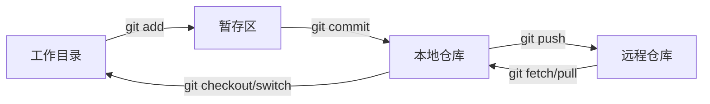
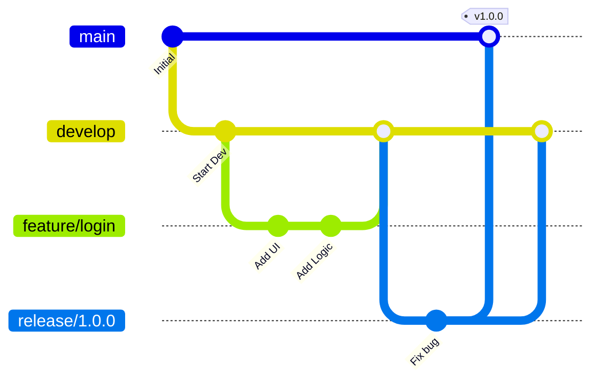
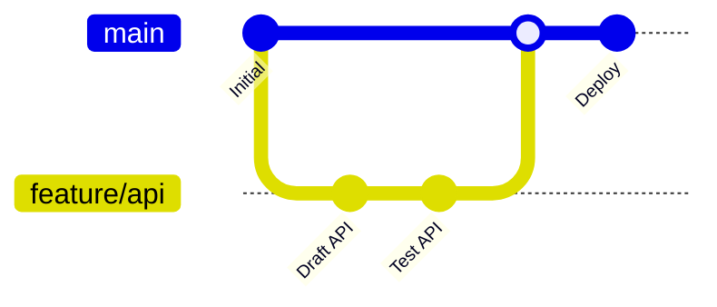

# Git 工作流与分支策略

本指南涵盖了 Git 工作流、分支策略、Conventional Commits 规范以及日常开发中的常用命令。

## 基础工作流

标准的 Git 工作流涉及将更改在三个主要区域之间移动：**工作目录** (Working Directory)、**暂存区** (Staging Area/Index) 和 **仓库** (Repository/HEAD)。

---

## 分支策略

选择合适的分支策略取决于团队规模和发布频率。

### 1. Git Flow
**最适用于：** 定期发布和版本化产品。

*   **main**: 仅限生产就绪代码。
*   **develop**: 功能集成分支。
*   **feature/**: 新功能临时分支。
*   **release/**: 新生产版本准备分支。
*   **hotfix/**: 生产环境 Bug 紧急修复。

### 2. GitHub Flow
**最适用于：** 持续部署 (CD) 和 Web 应用程序。

*   `main` 分支始终保持可部署状态。
*   从 `main` 创建短周期的功能分支。
*   CI/CD 通过后，通过 Pull Request 合并回 `main`。

---

## 约定式提交 (Conventional Commits)

标准化提交信息使历史记录清晰可读，并能实现自动生成变更日志 (Changelog)。

**格式：** `<type>(<scope>): <subject>`

| 类型 | 用途 | 示例 |
| :--- | :--- | :--- |
| `feat` | 新功能 | `feat(auth): add JWT support` |
| `fix` | Bug 修复 | `fix(api): handle null response` |
| `docs` | 仅文档更新 | `docs: update readme` |
| `refactor` | 代码重构（不修复 Bug 也不增加功能） | `refactor: simplify loop` |
| `chore` | 维护（构建、依赖、工具） | `chore: update docusaurus` |

:::tip 原子性
保持提交的**原子性**。一个提交应代表一个逻辑变更。这使 `git revert` 和 `git cherry-pick` 更加安全。
:::

---

## 常用命令

### 历史与检查

| 命令 | 用途 |
| :--- | :--- |
| `git status -s` | 简短状态摘要 |
| `git diff --staged` | 查看已加入暂存区的更改 |
| `git log --oneline --graph --all` | 所有分支的可视化展示 |
| `git blame <file>` | 识别每一行的修改者 |

### 撤销与恢复

| 命令 | 效果 | 场景 |
| :--- | :--- | :--- |
| `git commit --amend` | 修改最后一个提交 | 遗漏文件或提交信息拼写错误 |
| `git reset --soft HEAD~1` | 撤销提交，保留更改在暂存区 | 重新正确提交 |
| `git reset --hard HEAD~1` | **破坏性**：回退到上一状态 | 丢弃不需要的工作 |
| `git revert <hash>` | 创建一个撤销之前提交的新提交 | 安全地撤销已推送的提交 |

:::warning 强制推送
切勿在 `main` 或 `develop` 等共享分支上使用 `git push --force`。如果必须在变基后更新远程分支，请使用 `git push --force-with-lease`。
:::

---

## 高级工具

### Git Stash
临时保存未提交的更改以切换分支。
*   `git stash`: 保存工作
*   `git stash pop`: 恢复工作

### Git Worktree
在不同目录中同时处理同一仓库的多个分支。
*   `git worktree add ../fix-branch branch-name`

### Git Bisect
通过二分查找确定引入 Bug 的提交。
*   `git bisect start`
*   `git bisect bad`
*   `git bisect good <stable-hash>`

---

## 相关指南

*   [📄 Merge、Rebase 与 Cherry-Pick](./git-merge-rebase-cherry-pick.mdx) — 分支集成与历史改写。
*   [📄 Git Hooks 指南](./git-hooks-guide.mdx) — 自动化代码检查和测试。
*   [📄 子模块 (Submodules) 指南](./git-submodule-guide.mdx) — 管理外部依赖。
*   [📄 SSH 设置](../infra/06-ssh.mdx) — 安全远程访问。
