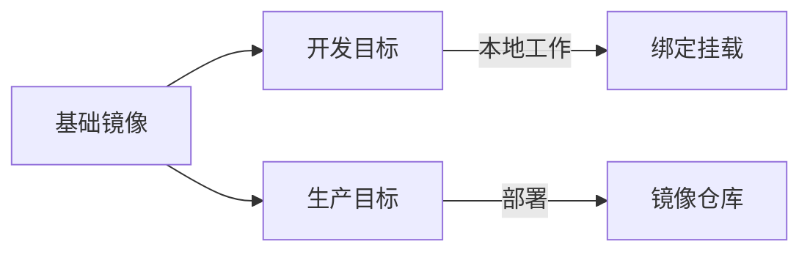

# 基础设施搭建 (Docker Compose)

本指南定义了使用 **Docker Compose** 进行本地基础设施编排的标准方法。我们优先采用 **分层、基于 Profile 的配置**，可从简单服务扩展到复杂的多平台架构。

## 🏗 Docker Compose 架构

使用 **分层 Compose 文件** 方法：基础文件定义核心基础设施，叠加文件（Overlay files）添加特定环境或特定 Profile 的配置。

### 目录结构

```text
infra/ (或 platform-dev/)
├── compose.yaml              # 基础：基础设施服务 (Postgres, Redis 等)
├── compose.dev.yaml          # 开发叠加：绑定挂载、调试端口、热重载
├── compose.staging.yaml      # 预发布叠加：生产目标、预发布配置
├── compose.prod.yaml         # 生产叠加：不可变镜像、资源限制
└── env/
    ├── compose.dev.env       # Compose 插值变量 (开发)
    ├── compose.staging.env   # Compose 插值变量 (预发布)
    ├── compose.prod.env      # Compose 插值变量 (生产)
    ├── shared.base.env       # 跨服务运行时变量 (所有环境)
    ├── shared.dev.env        # 跨服务运行时变量 (开发覆盖)
    ├── shared.prod.env       # 跨服务运行时变量 (生产值)
    ├── service-a.dev.env     # 特定服务变量 (开发)
    └── service-a.prod.env    # 特定服务变量 (生产)
```

:::tip 专业提示：文件命名
始终使用 `.yaml`（而非 `.yml`）以及 `compose.yaml`（现代标准），以保持跨项目的一致性。
:::

### 执行策略

```bash
# 后面的文件会覆盖前面的配置
docker compose \
  --env-file ./env/compose.dev.env \
  -f compose.yaml \
  -f compose.dev.yaml \
  --profile dev \
  up -d
```

---

## 🔀 Monorepo vs Polyrepo：Compose 布局

仓库策略直接影响 Compose 文件的组织方式和 `build.context` 的配置。

### Polyrepo 布局

每个服务有独立仓库。`infra/` 目录与服务代码平级：

```text
api-gateway/              # 服务仓库
├── Dockerfile
└── src/
infra/                    # 基础设施仓库（共享）
├── compose.yaml
└── compose.dev.yaml
```

`build.context` 指向服务目录：

```yaml
services:
  api:
    build:
      context: ../api-gateway    # 相对于 infra/
      dockerfile: Dockerfile
```

### Monorepo 布局

所有服务和共享库在同一仓库。Compose 文件通常位于仓库根目录或专用 `infra/` 目录：

```text
monorepo/
├── infra/
│   ├── compose.yaml
│   └── compose.dev.yaml
├── services/
│   ├── api-gateway/
│   │   └── Dockerfile
│   └── auth-service/
│       └── Dockerfile
└── libs/
    └── shared-utils/
```

`build.context` 指向仓库根目录，以便 Dockerfile 能 `COPY` 共享库：

```yaml
services:
  api:
    build:
      context: ../..                         # 仓库根目录
      dockerfile: services/api-gateway/Dockerfile
```

### 对比

| 维度 | Polyrepo | Monorepo |
| :--- | :--- | :--- |
| **Compose 位置** | 各仓库独立或共享 infra 仓库 | 仓库根目录或 `infra/` 目录 |
| **build.context** | 服务目录 | 仓库根目录（可访问共享库） |
| **共享服务** | 独立的 infra compose 文件 | 单一基础 compose 文件 |
| **服务隔离** | 天然（独立仓库） | 需要 profiles 或 filters |

---

## 📦 基础基础设施服务

基础 `compose.yaml` 文件定义了所有服务都依赖的共享基础设施。

### `compose.yaml` (节选)

```yaml
services:
  database:
    image: postgres:16-alpine
    environment:
      POSTGRES_USER: devuser
      POSTGRES_PASSWORD: devpass
      POSTGRES_DB: platform_db
    ports:
      - "5432:5432"
    volumes:
      - db_data:/var/lib/postgresql/data
    healthcheck:
      test: ["CMD-SHELL", "pg_isready -U devuser -d platform_db"]
      interval: 5s
      timeout: 3s
      retries: 10

  message-queue:
    image: rabbitmq:3-management-alpine
    environment:
      RABBITMQ_DEFAULT_USER: guest
      RABBITMQ_DEFAULT_PASS: guest
    ports:
      - "5672:5672"
      - "15672:15672"
    volumes:
      - mq_data:/var/lib/rabbitmq
    healthcheck:
      test: ["CMD", "rabbitmq-diagnostics", "ping"]
      interval: 5s
      timeout: 3s
      retries: 10
```

:::info 关键设计决策
- **健康检查 (Health Checks)**：始终包含健康检查，以便依赖服务可以使用 `condition: service_healthy` 来避免启动竞争条件。
- **命名卷 (Named Volumes)**：使用命名卷在容器生命周期内保持数据持久化。
- **Alpine 镜像**：优先使用基于 Alpine 的镜像，以获得更小的占用空间和更快的 CI/CD 拉取速度。
:::

---

## 🛠 开发覆盖 (Overrides)

开发叠加文件 (`compose.dev.yaml`) 添加了本地源代码的绑定挂载、调试端口以及特定于应用程序的服务。

### 开发模式

```yaml
services:
  api:
    build:
      context: ../api-gateway
      dockerfile: Dockerfile
      target: dev                         # 多阶段：使用 dev 目标
    command: npm run dev
    ports:
      - "3000:3000"
    volumes:
      - ../api-gateway:/workspace/api-gateway
      - /workspace/api-gateway/node_modules   # 防止宿主机覆盖 node_modules
    depends_on:
      database: { condition: service_healthy }
    env_file:
      - ./env/shared.base.env
      - ./env/shared.dev.env
    profiles:
      - dev
```

---

## 🔐 环境变量策略

我们遵循 **分层覆盖** 模式：基础契约 → 环境覆盖 → 机密信息。

| 层级 | 用途 | 来源 |
| :--- | :--- | :--- |
| **Compose 插值** | 控制镜像标签、项目名称 | `--env-file` 标志 |
| **共享基础** | 服务发现、队列名称 | `env_file` (shared.base.env) |
| **环境覆盖** | 日志级别、TTL | `env_file` (shared.dev.env) |
| **机密信息** | 密码、密钥 | **Vault / 外部管理器** |

:::danger 安全警示
**绝不** 将实际的生产机密信息提交到版本控制。使用 `.env.example` 文件作为模板，并在运行时使用安全的机密管理器注入机密。
:::

---

## 🌐 网络与服务发现

同一 Compose 项目中的所有服务共享一个默认的桥接网络，并可以通过 **服务名称** 相互解析。

### 连接示例

| 上下文 | 协议 | 地址 |
| :--- | :--- | :--- |
| **容器间** | Docker DNS | `http://database:5432` |
| **宿主机到容器** | 端口映射 | `http://localhost:5432` |
| **跨服务** | 共享网络 | `http://ai-service:8001/api/infer` |

---

## 📑 多阶段 Dockerfile 模式

每个服务 **必须** 使用多阶段构建，以将开发工具与生产运行时分离。



### 模式对比

| 维度 | 开发目标 (Dev Target) | 生产目标 (Prod Target) |
| :--- | :--- | :--- |
| **调试工具** | 包含 (Nodemon, Inspect) | 排除 |
| **依赖项** | 完整 (开发 + 运行时) | 仅运行时 |
| **源代码** | 绑定挂载 | 复制并构建 |
| **安全性** | 非 Root (映射 UID) | 最小化 (nobody/alpine) |

