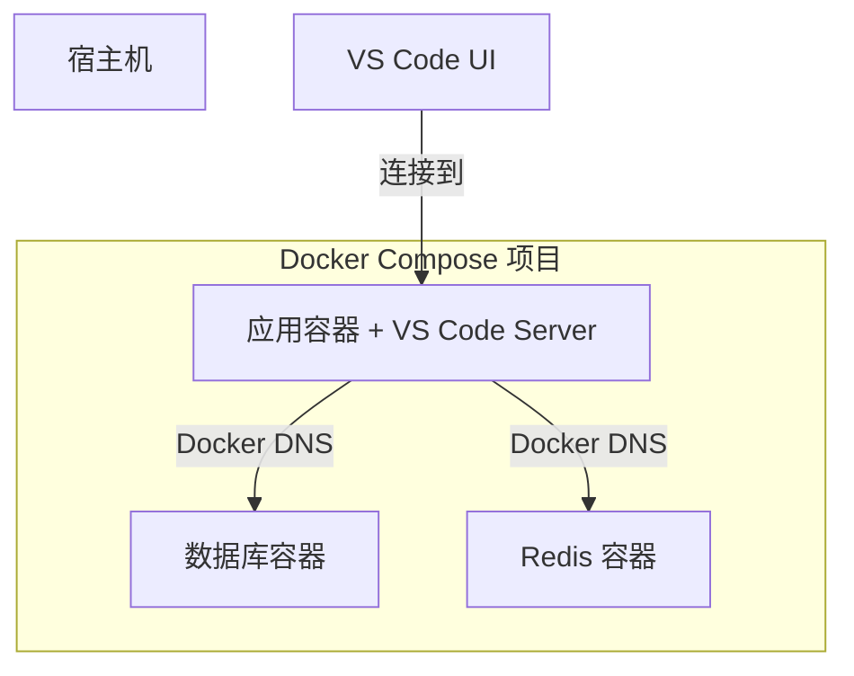

# 开发环境 (Dev Containers)

我们使用 **VS Code Dev Containers** 为每位工程师提供一致、隔离且可复用的开发环境。这种方法消除了“在我的机器上可以运行”的问题，并将入职配置时间从几天缩短到几分钟。

## 🌟 什么是 Dev Container？

**Dev Container** 是由 `devcontainer.json` 文件定义的标准化环境。它允许你将 Docker 容器用作功能齐全的开发环境。

### 开发体验

1.  **克隆** (Clone) 代码仓库。
2.  在 VS Code 中**打开**。
3.  根据提示选择 **在容器中重新打开** (Reopen in Container)。
4.  **等待**环境构建完成。
5.  **开始编码**，所有运行时、工具和扩展插件均已预先配置。

:::info[底层原理]
VS Code 的 UI 运行在宿主机上，而 **VS Code Server**、终端、调试器以及所有运行时（Node, Python, Go）都运行在容器**内部**。
:::

---

## ⚖️ Dev Container vs. 本地开发

| 特性 | 本地开发 | Dev Container |
| :--- | :--- | :--- |
| **一致性** | 不同机器间存在差异 | **所有人完全一致** |
| **入职配置** | 20 步安装指南 | **一键完成** |
| **隔离性** | 污染宿主机环境 | **完全隔离** |
| **版本管理** | 版本冲突 (如 Node 18 vs 20) | **项目特定** |
| **启动速度** | 即时 | 10-30 秒额外开销 |

---

## 🛠 使用 Docker Compose 进行编排

对于复杂的应用程序，我们将 **Dev Containers** 与 **Docker Compose** 结合使用，以同时管理应用程序及其依赖项（数据库、Redis 等）。



---

## 📝 配置 (devcontainer.json)

我们服务的典型配置如下：

```json
{
  "name": "Platform Service",
  "dockerComposeFile": [
    "../../infra/compose.yaml",
    "../../infra/compose.dev.yaml"
  ],
  "service": "api",
  "workspaceFolder": "/workspace/api",
  "remoteUser": "vscode",
  "customizations": {
    "vscode": {
      "extensions": [
        "ms-python.python",
        "dbaeumer.vscode-eslint",
        "eamodio.gitlens"
      ],
      "settings": {
        "editor.formatOnSave": true
      }
    }
  },
  "features": {
    "ghcr.io/devcontainers/features/git:1": {}
  },
  "postCreateCommand": "npm install && npm run db:migrate"
}
```

### Monorepo vs Polyrepo：Compose 文件路径

`devcontainer.json` 中 `dockerComposeFile` 的路径因仓库策略而异：

| 策略 | `dockerComposeFile` 示例 | 说明 |
| :--- | :--- | :--- |
| **Polyrepo** | `"../../infra/compose.yaml"` | `infra/` 在兄弟仓库或共享目录中。 |
| **Monorepo** | `"../../compose.yaml"` | Compose 文件在仓库根目录；`devcontainer.json` 在各服务的 `services/` 下。 |

```json title="Monorepo devcontainer.json"
{
  "name": "API Gateway",
  "dockerComposeFile": [
    "../../compose.yaml",
    "../../compose.dev.yaml"
  ],
  "service": "api-gateway",
  "workspaceFolder": "/workspace/services/api-gateway"
}
```

:::info[关键区别]
在 **Monorepo** 中，`workspaceFolder` 和 `service` 名称必须匹配服务的子目录路径。在 **Polyrepo** 中，`workspaceFolder` 通常映射到仓库根目录。
:::

---

## 🔧 Dev Container Features

**Features** 是可安装的预打包单元，可以在不修改 `Dockerfile` 的情况下向 Dev Container 添加工具、运行时或 CLI 工具。这是扩展开发环境的模块化、声明式方式。

### 使用方式

在 `devcontainer.json` 的 `"features"` 字段中添加：

```json
{
  "features": {
    "ghcr.io/devcontainers/features/node:1": { "version": "20" },
    "ghcr.io/devcontainers/features/aws-cli:1": {},
    "ghcr.io/devcontainers/features/terraform:1": { "version": "1.7" }
  }
}
```

### Features vs. Dockerfile vs. Compose

| 方式 | 适用场景 | 取舍 |
| :--- | :--- | :--- |
| **Dev Container Features** | 跨项目共享的标准工具（AWS CLI、Git、Terraform）。 | 声明式、自动更新、无需修改 Dockerfile。仅限目录中可用的工具。 |
| **Dockerfile `RUN`** | 自定义或项目特定的工具安装。 | 完全控制，但增加镜像构建时间和 Dockerfile 复杂度。 |
| **Compose `command`** | 运行时配置、环境设置、服务编排。 | 影响容器生命周期，不影响工具可用性。 |

:::tip[推荐]
优先使用 **Features** 目录中已有的工具。只有当工具不在目录中或需要自定义构建步骤时，才回退到 `Dockerfile` 安装。
:::

---

## 💻 Dev Container CLI

**Dev Container CLI**（`@devcontainers/cli`）是 [Dev Containers 规范](https://containers.dev/) 的参考实现。它允许你通过命令行构建和管理开发容器，无需依赖 VS Code。

### 安装

```bash
# 全局安装
npm install -g @devcontainers/cli

# 或直接通过 npx 使用
npx @devcontainers/cli --help
```

### 常用命令

| 命令 | 说明 |
| :--- | :--- |
| `devcontainer up` | 从 `devcontainer.json` 创建并启动开发容器 |
| `devcontainer exec <cmd>` | 在运行中的开发容器内执行命令 |
| `devcontainer build` | 构建开发容器镜像（用于发布） |
| `devcontainer read-configuration` | 读取并解析完整的 `devcontainer.json` 配置 |

### 典型场景

**无需 VS Code 即可在开发容器中运行命令：**

```bash
devcontainer up --workspace-folder .
devcontainer exec --workspace-folder . npm test
```

**在 CI/CD 中预构建并发布开发容器镜像：**

```bash
devcontainer build --workspace-folder . --push true --image-name ghcr.io/my-org/devcontainer:latest
```

这在 CI 流水线中预构建镜像并推送到容器注册表时非常有用，可以显著加快容器启动速度。

:::tip[何时使用 CLI]
当你需要**在 VS Code 之外**与开发容器交互时使用 CLI —— 例如 CI/CD 流水线、无头服务器或非 VS Code 编辑器。日常开发中，VS Code Dev Containers 扩展提供最无缝的体验。
:::

---

## 🔐 SSH Agent 转发

为了确保私钥安全，我们使用 **SSH Agent 转发**。你的私钥永远不会进入容器；容器只需“请求”宿主机对 Git 或 SSH 操作进行签名。

### 宿主机准备

#### macOS/Linux
```bash
# 将私钥添加到 agent
ssh-add ~/.ssh/id_ed25519
```

#### Windows (WSL2)
确保 SSH agent 在 WSL2 环境中运行并已添加私钥。

### 容器内验证
```bash
# 在容器终端内执行
echo $SSH_AUTH_SOCK
# 应输出: /run/host-services/ssh-auth.sock

ssh-add -l
# 应列出宿主机的私钥
```

---

## 🚀 日常工作流

### 开始工作
```bash
# 在宿主机上：启动基础架构
docker compose --profile dev up -d
```

### 编写代码
- 打开 VS Code。
- 在容器中重新打开。
- 编辑代码（通过挂载卷实现热重载）。

### 提交更改
Git 操作可以在容器的集成终端中自然运行。
```bash
git add .
git commit -m "feat: add new endpoint"
git push origin main
```

---

## ❓ 常见问题排查

### "fatal: detected dubious ownership"
**原因**：宿主机与容器之间的文件权限不匹配。
**解决**：在容器内运行 `git config --global --add safe.directory '*'`，或确保 `devcontainer.json` 中 `updateRemoteUserUID` 设置为 `true`。

### SSH 身份验证失败
**原因**：宿主机上未运行 SSH agent 或未添加私钥。
**解决**：在宿主机上运行 `ssh-add -l` 检查私钥是否已加载。

