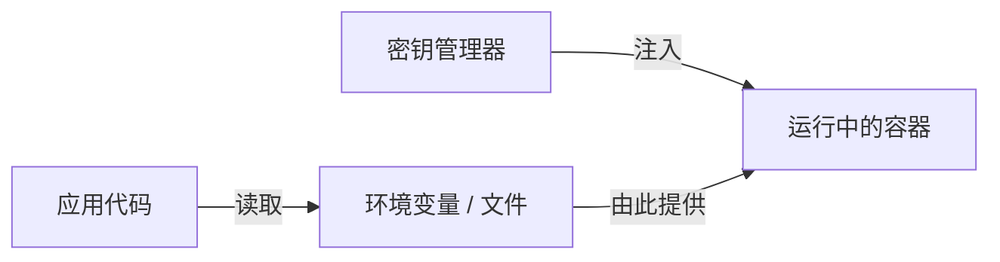
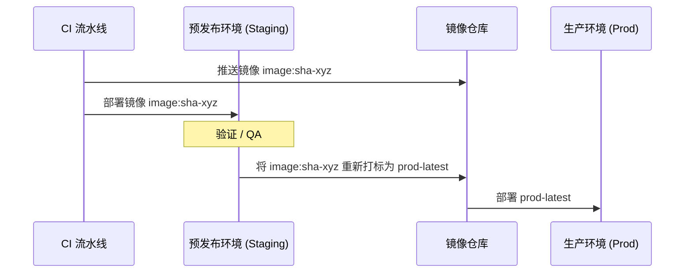

# 生产部署

我们的部署策略侧重于 **环境一致性**、**不可变镜像** 和 **自动化流水线**。我们确保在推送到生产环境之前，在预发布 (Staging) 环境中验证完全相同的构建产物。

## 🏗 环境分层

| 层级 | 用途 | 构建目标 | 配置来源 |
| :--- | :--- | :--- | :--- |
| **开发环境 (Dev)** | 本地迭代 | `dev` | `.dev.env` (插值) |
| **预发布环境 (Staging)** | 生产前验证 | **`prod`** | `.staging.env` + CI 密钥 |
| **生产环境 (Prod)** | 面向客户 | **`prod`** | **外部密钥管理器** |

:::info[部署原则]
**一次构建，多次部署**：我们仅构建一次 Docker 镜像（使用 `prod` 目标），并通过仅更改配置（环境变量）将其推广到各个环境。
:::

---

## 🏷 镜像构建与标签

我们使用 **Git SHAs** 进行确定性打标，确保每个部署的镜像都能追溯到特定的提交。

```bash
GIT_SHA=$(git rev-parse --short HEAD)
# 标签示例: registry.company.com/service-name:sha-a1b2c3d
```

### 使用 Docker Buildx Bake 进行批量构建
对于多服务平台，我们使用 `docker-bake.hcl` 来并行化构建并管理复杂的依赖关系。

```hcl
group "default" {
  targets = ["api", "worker", "frontend"]
}

target "api" {
  context = "../api"
  dockerfile = "Dockerfile"
  target = "prod"
  tags = ["${REGISTRY}/api:sha-${GIT_SHA}", "${REGISTRY}/api:latest"]
}
```

---

## 🔐 密钥管理

**生产环境密钥绝不能存储在版本控制或 `.env` 文件中。**



### 安全检查清单
- [ ] **Git 中无密钥**：使用 `.env.example` 作为模板。
- [ ] **运行时注入**：在容器编排层面注入密钥（K8s Secrets, Docker Secrets 或 Vault）。
- [ ] **最小权限**：仅注入特定服务实际需要的密钥。

---

## 🔄 数据库迁移

迁移与应用程序启动解耦，以防止竞态条件并确保回滚安全。

1.  **运行迁移**：运行一个针对数据库的短寿命“迁移”容器。
2.  **验证成功**：部署流水线等待迁移完成。
3.  **部署应用**：仅在迁移成功后才滚动更新应用程序容器。

:::caution[向后兼容性]
务必确保数据库迁移是**向后兼容**的，这样当前运行的（旧版本）应用在迁移过程中不会崩溃。
:::

---

## 🚀 推广工作流

在经过手动或自动化验证后，我们将镜像从预发布环境推广到生产环境。


