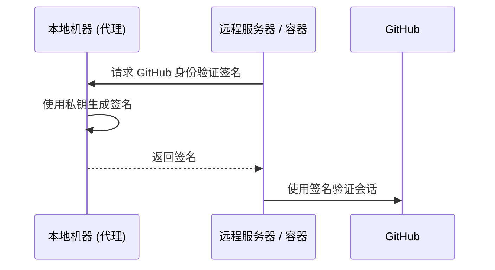

# SSH 访问安全

对远程服务器和 Git 仓库的安全访问从根本上建立在 **SSH (Secure Shell)** 协议之上。我们利用非对称加密技术，确保身份验证凭据永远不会在网络上传输，并仅存储在您的本地计算机上。

## SSH 加密基础

SSH 身份验证依赖于由两个数学相关文件组成的 **公私钥对**。

| 组件 | 默认路径 | 用途 |
| :--- | :--- | :--- |
| **私钥** | `~/.ssh/id_ed25519` | **受限访问。** 仅存储在您的本地计算机上。 |
| **公钥** | `~/.ssh/id_ed25519.pub` | **公开分发。** 分发到服务器和 GitHub。 |

:::tip[算法建议]
我们为所有新密钥对统一采用 **Ed25519** 算法。与旧的 RSA 标准相比，它具有更优越的性能和更高的安全性。
:::

---

## 基础设施设置指南

### 生成密钥对
执行以下命令生成新的密钥对：
```bash
ssh-keygen -t ed25519 -C "your_email@example.com"
```
:::note[密码处理]
接受默认存储路径并为本地加密提供强密码。
:::

### 使用 SSH 代理进行管理
使用 SSH 代理在内存中管理已解密的密钥，从而无需为每次连接重新输入密码。
```bash
# 初始化 SSH 代理
eval "$(ssh-agent -s)"

# 向代理注册私钥
ssh-add ~/.ssh/id_ed25519
```

### 与 GitHub 集成
获取您的公钥并将其添加到您的 **GitHub 设置 → SSH and GPG keys** 中。
```bash
# 复制到剪贴板或显示公钥
cat ~/.ssh/id_ed25519.pub
```

### 连接验证
```bash
ssh -T git@github.com
# 预期输出: "Hi <username>! You've successfully authenticated..."
```

---

## 高级工作流：代理转发 (Agent Forwarding)

**代理转发** 允许在远程会话（例如，在服务器或 Docker 容器内）中使用本地 SSH 密钥，而无需将私钥复制到这些环境中。

### 身份验证工作流



### Docker 实现
挂载主机的 SSH 代理套接字以在容器内启用转发：
```bash
docker run -it \
  -v $SSH_AUTH_SOCK:/run/host-services/ssh-auth.sock \
  -e SSH_AUTH_SOCK=/run/host-services/ssh-auth.sock \
  my-engineering-image bash
```

:::caution[安全协议]
仅在连接到 **受信任的** 基础设施时使用代理转发。受损的远程 root 用户可能会利用您的转发代理套接字以您的身份进行身份验证。
:::

---

## SSH 配置策略

通过在 `~/.ssh/config` 中定义主机别名来优化连接工作流：

```text title="~/.ssh/config"
Host production-server
    HostName 10.0.0.50
    User deploy-user
    ForwardAgent yes
    IdentityFile ~/.ssh/id_ed25519
```
*工作流效率：* 执行 `ssh production-server` 即可连接，无需手动指定参数。

---

:::tip[最佳实践]
定期审核远程服务器上的 `~/.ssh/authorized_keys` 文件，确保只有当前授权的密钥处于活动状态。
:::
