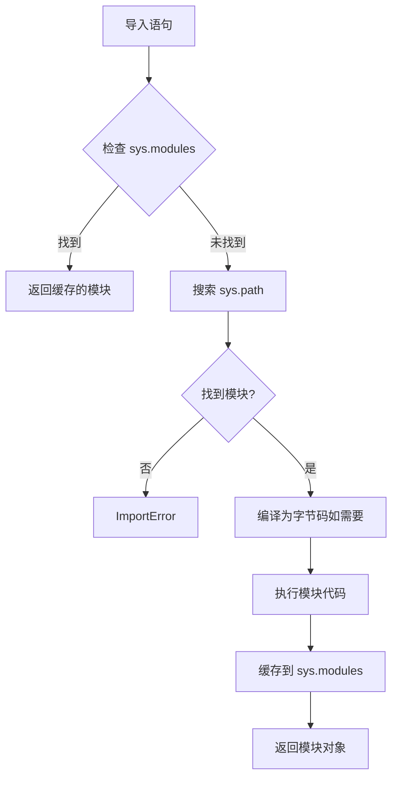

# Python 导入系统

Python 的导入系统是一个核心机制，影响代码组织、性能和可维护性。理解导入的工作原理对于构建可扩展应用程序至关重要，特别是在深度学习项目等大型代码库中。

## 导入基础

### 绝对导入 vs 相对导入

Python 支持两种导入风格，各有特定使用场景。

| 导入类型 | 语法 | 使用场景 | 作用域 |
| :--- | :--- | :--- | :--- |
| **绝对导入** | `from package import module` | 生产代码、库 | 项目级 |
| **显式相对导入** | `from . import sibling` | 包内部模块 | 包内 |
| **隐式相对导入** | `import sibling` | **Python 3 中已弃用** | - |

**绝对导入**适用于大多数场景：

```python
# ✅ 推荐：绝对导入
from my_package.utils.helpers import load_config
from my_package.core.engine import InferenceEngine

# ✅ 可接受：显式相对导入（同一包内）
from .utils.helpers import load_config
from ..core.engine import InferenceEngine

# ❌ 避免：隐式相对导入（Python 3 报错）
import helpers  # 在 Python 3 中引发 ImportError
```

:::tip[何时使用相对导入]
相对导入适用于以下场景：
- 重构包内部代码，包名可能改变
- 同一包内导入路径过长
- 需要明确指示导入的模块属于同一包
:::

### `__init__.py` 的作用

`__init__.py` 文件将目录标记为 Python 包，并可以控制包的公共 API。

```python
# my_package/__init__.py
from .core import Engine
from .utils import load_config

# 定义公共 API
__all__ = ["Engine", "load_config"]
```

:::info[最佳实践]
使用 `__init__.py` 来：
- 提供简化的包级 API
- 从导入中隐藏内部模块
- 执行包初始化代码（日志记录、版本检查）
:::

### 导入搜索路径（`sys.path`）

Python 按以下顺序搜索模块：

1. **当前目录**（对于脚本）或**脚本所在目录**
2. **`PYTHONPATH` 环境变量**中的目录
3. **标准库位置**（取决于安装）
4. **site-packages**（第三方包）

```python
import sys
print("\n".join(sys.path))

# 以编程方式添加自定义路径（谨慎使用）
sys.path.append("/custom/module/path")
```

:::danger[危险]
避免在生产代码中以编程方式修改 `sys.path`。这会使代码变得脆弱且依赖部署环境。应使用正确的包安装或 `PYTHONPATH` 代替。
:::

---

## 导入机制（底层原理）

### `sys.modules` 缓存

Python 在 `sys.modules` 中维护已导入模块的缓存。一旦模块被导入，后续的导入将返回缓存的模块对象。

```python
import sys
import math

# 首次导入后模块被缓存
print(math is sys.modules["math"])  # True

# 重新加载（很少需要）
import importlib
importlib.reload(math)
```

:::note
`sys.modules` 缓存意味着导入语句本质上是单例构造函数。模块级代码在每个解释器会话中只执行一次。
:::

### 导入语句执行流程



### 使用 `importlib` 动态导入

对于运行时动态导入，使用 `importlib` 模块而不是 `__import__` 或 `eval`。

```python
import importlib

# 通过字符串名称动态导入
module_name = "yaml"
yaml = importlib.import_module(module_name)

# 条件导入（适用于可选依赖）
try:
    import plotly
except ImportError:
    plotly = None

def plot(data):
    if plotly is None:
        raise ImportError("plotly 是可视化所必需的")
    plotly.plot(data)
```

:::tip[使用场景]
动态导入适用于：
- 插件系统
- 延迟加载重型依赖
- 功能标志和可选依赖
:::

---

## 工程实践

### 避免循环导入

当模块 A 导入模块 B，而模块 B 导入模块 A（直接或间接）时，会发生循环导入。这会导致运行时错误或未定义行为。

**问题：**

```python title="models.py"
from trainers import Trainer

class Model:
    def train(self):
        return Trainer().train(self)
```

```python title="trainers.py"
from models import Model

class Trainer:
    def train(self, model: Model):
        pass
```

**解决方案：**

**✅ 方案 1：使用字符串字面量的类型提示**

```python title="models.py"
from typing import TYPE_CHECKING

if TYPE_CHECKING:
    from trainers import Trainer

class Model:
    def train(self):
        from trainers import Trainer  # 局部导入
        return Trainer().train(self)
```

---

**✅ 方案 2：重构为第三个模块**

```python title="interfaces.py"
from abc import ABC, abstractmethod

class Trainable(ABC):
    @abstractmethod
    def train(self): pass
```

```python title="models.py"
from trainers import Trainer
from interfaces import Trainable

class Model(Trainable):
    def train(self):
        return Trainer().train(self)
```

:::info[运行时 vs 类型检查]
`TYPE_CHECKING` 常量在运行时为 `False`，但在静态类型检查期间为 `True`。这允许为类型提示导入模块而不会导致循环依赖。
:::

### 导入性能优化

对于大型应用程序，考虑对重型依赖进行延迟导入。

**❌ 急切加载：所有导入在启动时加载**

```python
import torch
import transformers
import numpy as np

def main():
    # 即使未使用也会加载重型模块
    pass
```

**✅ 延迟加载：推迟导入直到需要时**

```python
def main():
    import torch
    import transformers
    import numpy as np

    # 仅在调用 main() 时才加载模块
    pass
```

**✅ 使用 `importlib` 的显式延迟加载**

```python
import importlib

_torch = None

def get_torch():
    global _torch
    if _torch is None:
        import torch
        _torch = torch
    return _torch
```

:::tip[权衡]
延迟导入可以改善启动时间，但会将错误从启动时转移到运行时。将其用于真正可选或很少使用的依赖。
:::

### 导入语句风格（PEP 8）

将导入组织为三组，组之间用空行分隔：

```python
# 1. 标准库导入
import os
import sys
from pathlib import Path

# 2. 第三方导入
import numpy as np
import torch
from fastapi import FastAPI

# 3. 本地应用导入
from my_package.core import Engine
from my_package.utils.helpers import load_config
```

配置 **Ruff** 自动执行此操作：

```toml
[tool.ruff.lint.isort]
known-first-party = ["my_package"]
force-sort-within-sections = true
```

---

## 常见陷阱

### 遮蔽标准库模块

避免将文件或模块命名为与标准库模块相同的名称。

```text
# ❌ 有问题的结构
project/
├── random.py         # 遮蔽标准库 random
└── main.py

# main.py
import random  # 导入你的文件，而非标准库！
```

:::danger[危险]
被遮蔽的模块会导致神秘的 bug，并使调试变得极其困难。始终检查命名冲突。
:::

### 相对导入边界

相对导入不能超过顶层包。

```python
# ✅ 有效：包内
# my_package/subpkg1/module.py
from ..subpkg2 import helper

# ❌ 无效：包外
# my_package/subpkg1/module.py
from ...external_lib import something  # ImportError
```

### 可执行模块 vs 可导入包

模块可以既是可执行的又是可导入的：

```python
# my_package/cli.py
import argparse

def main():
    """CLI 的入口点。"""
    parser = argparse.ArgumentParser()
    args = parser.parse_args()
    # CLI 逻辑在这里

if __name__ == "__main__":
    main()  # 仅在直接执行时运行
```

在 `pyproject.toml` 中配置：

```toml
[project.scripts]
mycli = "my_package.cli:main"
```

---

## 检查清单

- [ ] 默认使用绝对导入
- [ ] 使用 `TYPE_CHECKING` 或重构避免循环依赖
- [ ] 配置 Ruff 强制执行导入排序
- [ ] 永远不要在生产代码中修改 `sys.path`
- [ ] 使用 `__init__.py` 定义清晰的包 API
- [ ] 检查模块名遮蔽
- [ ] 考虑对重型依赖使用延迟导入

---

## 延伸阅读

- [PEP 8 -- Python 代码风格指南](https://peps.python.org/pep-0008/#imports)
- [PEP 328 -- 导入：多行和绝对/相对](https://peps.python.org/pep-0328/)
- [Python 导入系统文档](https://docs.python.org/zh-cn/3/reference/import.html)
- [`importlib` 包](https://docs.python.org/zh-cn/3/library/importlib.html)
