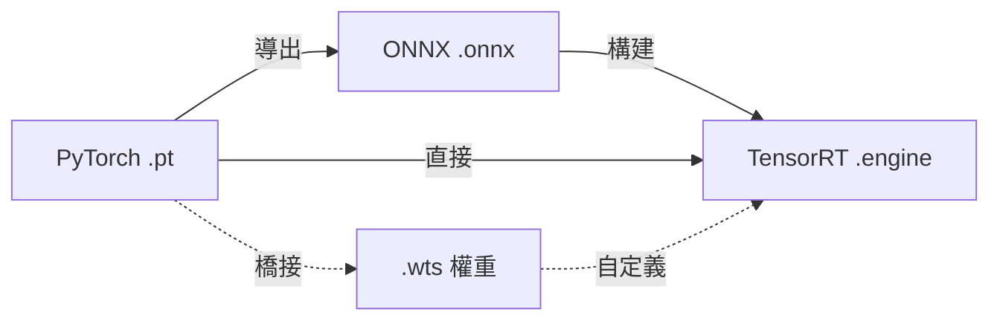

# 深度學習模型文件

在深度學習生命週期中，不同的模型格式服務於不同的目的，涵蓋從訓練到部署的各個階段。

## 格式關係

下圖展示了現代深度學習模型的標準轉換鏈。

## 支持的格式

| 格式 | 角色 | 主要用途 |
| :--- | :--- | :--- |
| **[.pt / .pth](./pytorch-pt-guide)** | 訓練 | PyTorch 原生存儲，包含權重和架構。 |
| **[.onnx](./onnx-overview)** | 轉換 | 框架間的通用橋樑 (Open Neural Network Exchange)。 |
| **[.engine / .plan](./tensorrt-engine)** | 部署 | 在 NVIDIA GPU 上進行高性能優化推理。 |
| **[.wts](./wts-bridge)** | 橋接 | 用於自定義 TensorRT 構建器的純文本權重存儲。 |

:::tip 建議
90% 的生產模型標準路徑是：**`.pt` → `.onnx` → `.engine`**。
:::

## 核心概念

- **框架無關性**：ONNX 允許你在不同工具之間移動模型，而不會被特定框架鎖定。
- **硬件優化**：TensorRT 引擎綁定到特定的 GPU 架構和驅動版本，以實現巔峰性能。
- **單向轉換**：雖然可以從 `.pt` 轉換為 `.engine`，但通常無法逆轉此過程。
