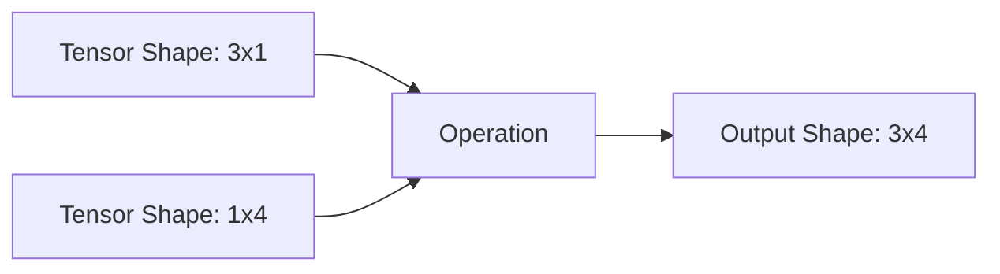

# 張量操作

張量是 PyTorch 中的核心資料結構，功能類似於 NumPy 陣列，但支援硬體加速。

## 建立

使用工廠函數建立張量。始終指定 `dtype` 和 `device` 以獲得最佳效能。

```python
import torch

# 從列表或 NumPy 陣列建立
tensor_a = torch.tensor([[1.0, 2.0], [3.0, 4.0]], dtype=torch.float32)

# 建立全零、全一或隨機值的張量
zeros = torch.zeros((3, 3), device='cuda')
ones = torch.ones((2, 2))
random_tensor = torch.randn((10, 10))
```

## 索引

使用標準的 Python 索引語法存取張量的特定元素或切片。

```python
x = torch.arange(9).reshape(3, 3)

# 擷取第二行
row = x[1, :]

# 擷取一個區塊
block = x[:2, :2]
```

## 廣播機制

在算術運算期間，PyTorch 會自動擴展較小的張量以符合較大張量的形狀。



```python
a = torch.ones(3, 1)
b = torch.ones(1, 4)
# b 被廣播為 3x4，a 被廣播為 3x4
c = a + b 
```

:::tip[形狀相容性]
如果兩個維度相等或其中一個維度為 1，則它們在廣播時是相容的。
:::

## 維度變換：Reshape、View 和 Permute

在不改變底層資料的情況下操作張量維度。

- `view()`: 回傳共享相同資料的新張量。要求張量在記憶體中是連續的 (contiguous)。
- `reshape()`: 回傳新張量。如果可能則使用 `view()`，否則會複製資料。
- `permute()`: 交換維度。

```python
x = torch.randn(2, 3, 4)

# 展平
flat_x = x.view(-1) # Shape: 24

# 交換維度 (例如，從 NCHW 到 NHWC)
permuted_x = x.permute(0, 2, 3, 1)
```

:::caution[記憶體配置]
諸如 `permute()` 或 `transpose()` 等操作會使張量在記憶體中變得不連續。在此類張量上使用 `.view()` 之前，請先呼叫 `.contiguous()`。
:::

```python
y = x.transpose(0, 1)
# y.view(-1)  # 這將引發錯誤！
z = y.contiguous().view(-1) # 正確
```