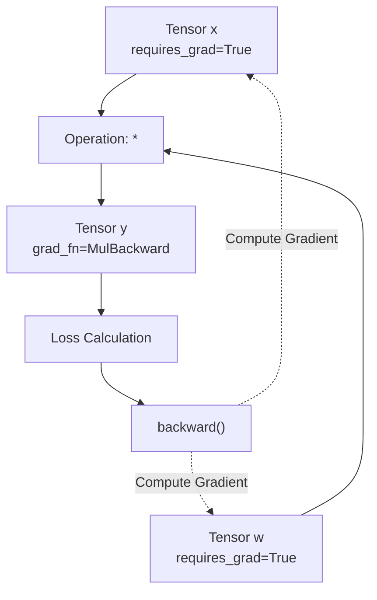

# 自動求導機制

PyTorch 的 `autograd` 引擎可自動為神經網路訓練計算梯度。隨著操作的執行，它會動態建構一個有向無環計算圖。

## 計算圖

當對設定了 `requires_grad=True` 的張量執行操作時，PyTorch 會追蹤這些操作並建立一個計算圖。



## `requires_grad` 與 `grad_fn`

透過設定 `requires_grad=True` 啟用梯度追蹤。

```python
import torch

x = torch.tensor([1.0, 2.0], requires_grad=True)
w = torch.tensor([3.0, 4.0], requires_grad=True)

y = x * w
print(y.grad_fn) # <MulBackward0 object>
```

`grad_fn` 屬性參照了建立該張量的數學函數，從而允許 `autograd` 引擎回溯微分步驟。

## 反向傳播

透過在輸出張量（通常是損失值）上呼叫 `.backward()` 來計算梯度。

```python
loss = y.sum()
loss.backward()

# 梯度儲存在 .grad 屬性中
print(x.grad) # [3.0, 4.0]
print(w.grad) # [1.0, 2.0]
```

## 停用梯度追蹤

在評估模型或執行推論時，防止 PyTorch 追蹤計算歷史記錄，以節省記憶體和運算資源。

### `torch.no_grad()`

使用此上下文管理器包裝不需要計算梯度的程式碼區塊。

```python
with torch.no_grad():
    y_pred = x * w
    # y_pred.requires_grad 為 False
```

### `.detach()`

建立一個新的張量，該張量共享相同的資料，但從計算圖中分離出來。

```python
y_detached = y.detach()
# y_detached.requires_grad 為 False
```

## 梯度累加與歸零

預設情況下，PyTorch 會在 `.grad` 屬性中累加梯度。在進行下一次反向傳播之前，必須手動將梯度歸零，以防止它們在多個批次中累加。

```python
# 假設存在一個最佳化器
optimizer.zero_grad() # 梯度歸零
loss.backward()       # 計算新梯度
optimizer.step()      # 更新權重
```

:::info[梯度累加]
梯度累加是在模擬更大批次大小（Batch Size）時非常有用的功能。您可以在呼叫 `optimizer.step()` 和 `optimizer.zero_grad()` 之前多次呼叫 `.backward()`。
:::
