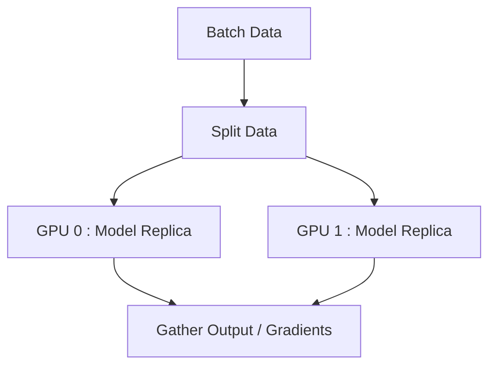

# 裝置管理

PyTorch 允許明確控制張量和模型的分配位置。利用諸如 GPU 之類的硬體加速器對於深度學習效能至關重要。

## CPU 和 CUDA 切換

檢查 GPU 的可用性並動態分配裝置。始終使用動態裝置分配，而不是硬編碼 `cuda`。

```python
import torch

# 動態設定裝置
device = torch.device("cuda" if torch.cuda.is_available() else "cpu")
print(f"正在使用裝置: {device}")
```

## 使用 `.to()` 移動資料

使用 `.to()` 方法將張量和模型移動到目標裝置。

```python
# 在 CPU 上建立張量
x_cpu = torch.ones(5, 5)

# 將張量移動到 GPU（如果可用）
x_gpu = x_cpu.to(device)

# 移動模型
import torch.nn as nn
model = nn.Linear(10, 2)
model.to(device)
```

:::caution[操作相容性]
張量之間的操作必須在同一裝置上進行。將 CPU 張量與 CUDA 張量相加將導致執行階段錯誤。
:::

## 裝置上下文管理器

在現代 PyTorch 中，您可以使用上下文管理器直接在目標裝置上實例化張量，這比在 CPU 上建立它們然後再移動它們的記憶體效率更高。

```python
# 在上下文中建立的張量將分配在指定的裝置上
with torch.device(device):
    x = torch.randn(100, 100) # 如果 device=='cuda'，直接在 GPU 上建立
    y = torch.ones(100, 100)
```

## 多 GPU 概述

在處理多 GPU 時，PyTorch 提供了 `DataParallel` (DP) 和 `DistributedDataParallel` (DDP)。



### `DataParallel` (DP)

一個簡單的單行包裝器，用於在單台機器上利用多個 GPU。然而，它受到全域直譯器鎖 (GIL) 和 GPU 利用率不均的困擾。

```python
if torch.cuda.device_count() > 1:
    print(f"讓我們使用 {torch.cuda.device_count()} 個 GPU！")
    model = nn.DataParallel(model)

model.to(device)
```

:::tip[生產環境推薦使用 DDP]
對於生產程式碼和多節點設定，請始終使用 `DistributedDataParallel` (DDP) 而不是 `DataParallel`。DDP 會產生多個行程，繞過 GIL，並提供顯著更好的效能。
:::
