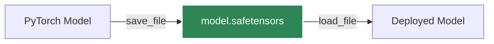

# 序列化

正確儲存和載入模型對於暫停訓練、共享模型或部署到生產環境至關重要。PyTorch 提供了標準的序列化機制。

## `state_dict`

`state_dict` 是一個簡單的 Python 字典物件，它將每一層對應到其參數張量。只有具有可學習參數（卷積層、線性層等）和註冊緩衝區的層才在模型的 `state_dict` 中有對應條目。

### 儲存權重與儲存整個模型

:::caution[最佳實踐]
**始終儲存 `state_dict` 而不是整個模型物件。** 儲存整個模型物件會將序列化資料與儲存期間使用的特定類別定義和目錄結構耦合，當程式碼發生變化時很容易崩潰。
:::

#### 推薦方式：儲存 `state_dict`

```python
import torch

# 儲存模型的權重
torch.save(model.state_dict(), 'model_weights.pth')

# 載入權重（需要先初始化模型架構）
model = TheModelClass(*args, **kwargs)
model.load_state_dict(torch.load('model_weights.pth'))
model.eval() # 記住呼叫 eval() 進行推論
```

#### 不推薦方式：儲存整個模型

```python
# 不良實踐 - 將序列化資料綁定到確切的程式碼結構上
torch.save(model, 'entire_model.pth')
model = torch.load('entire_model.pth')
```

## 恢復訓練

要恢復訓練，您必須儲存模型的 `state_dict` 和最佳化器的 `state_dict`，以及其他元資料（如當前 epoch）。

```python
checkpoint = {
    'epoch': epoch,
    'model_state_dict': model.state_dict(),
    'optimizer_state_dict': optimizer.state_dict(),
    'loss': loss,
}
torch.save(checkpoint, 'checkpoint.pth')
```

## `safetensors` 格式

預設的 `torch.save` 依賴於 Python 的 `pickle` 模組，它無法防禦惡意載荷。如果是在公開分享模型或將其部署到生產環境中，請使用 Hugging Face 提供的 `safetensors` 格式。



```python
from safetensors.torch import save_file, load_file

# 儲存
save_file(model.state_dict(), "model.safetensors")

# 載入
state_dict = load_file("model.safetensors")
model.load_state_dict(state_dict)
```

:::info[Safetensors 優勢]
`safetensors` 載入速度顯著提升，限制了記憶體使用（零拷貝），並且安全可靠，不會執行任意程式碼。
:::
