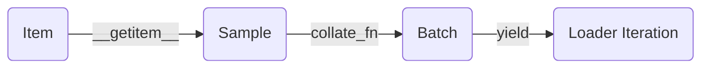

# 數據管線

在 PyTorch 中，數據管線並不只是 `Dataset` 和 `DataLoader` 兩個類別的簡單組合。要構建穩健、可擴展的數據流，我們必須從底層的樣本設計出發，理解數據在其生命週期中的各個階段：



## 核心定義與職責邊界

PyTorch 對數據處理原語的職責劃分非常明確：

- **`Dataset`**：負責「定義一條樣本是什麼、怎麼按索引取到它」。它的職責是**描述單個樣本的讀取和變換邏輯**。
- **`DataLoader`**：負責「把這些樣本按批次、順序和並行方式送出來給訓練循環使用」。它的職責不是理解業務語義，而是**組織數據流**（批次、打亂、多進程）。

如果將數據管線比作餐廳：`Dataset` 是廚房的**單份出餐規則**，而 `DataLoader` 則是**傳菜系統**（一次上幾份、按什麼順序、是否多工並行）。

## 核心類別的系統定義

在進入複雜的鏈路之前，我們先從程式碼層面認識 PyTorch 數據系統的基石：

### `Dataset` 基類
`torch.utils.data.Dataset` 的核心是定義數據讀取。最常見的 Map-style Dataset 只需要實作三個魔法方法：
- `__init__`：負責一次性的元資料準備（如讀取 CSV 標註、保存路徑、初始化 transform）。
- `__len__`：返回數據集的總樣本數，讓外部知道數據的規模。
- `__getitem__`：**最關鍵的方法**，給定一個索引 `idx`，返回該位置的**單條樣本**。

**基礎模板**：
```python
from torch.utils.data import Dataset

class CustomDataset(Dataset):
    def __init__(self, data_list):
        self.data = data_list
        
    def __len__(self):
        return len(self.data)
        
    def __getitem__(self, idx):
        # 提取、解析單一樣本
        item = self.data[idx]
        return item
```

### `DataLoader` 基類
`torch.utils.data.DataLoader` 並不是一個數據容器，而是一個**迭代器引擎**。它在 Dataset 外面包了一層，核心參數包括：
- `dataset`：提供數據的來源物件。
- `batch_size`：每次抓取多少個樣本組裝成一個批次。
- `shuffle`：每個 epoch 是否打亂數據順序。
- `num_workers`：分配幾個子進程並行拉取數據（0 表示單進程主線程）。
- `collate_fn`：定義如何將 `batch_size` 個單樣本拼接成批次的方法。

**基礎調用**：
```python
from torch.utils.data import DataLoader

dataloader = DataLoader(
    dataset=CustomDataset([1, 2, 3, 4, 5]),
    batch_size=2,
    shuffle=True,
    num_workers=0
)
# 使用時：for batch in dataloader: ...
```

---

## 建立思維模型：數據鏈路的四個階段

對於標準的 Map-style 數據集，其核心鏈路如下：

1. **Item（原子數據）**：最底層的基礎數據片段。
2. **Sample（單樣本）**：經過解析、解碼、初步變換後，具有完整業務語義的單條數據（通常就是 `dataset[idx]` 的返回值）。
3. **Batch（批次數據）**：多個 Sample 經過彙總合併（通常透過 `collate_fn`）後形成的張量組，直接作為模型的輸入。
4. **DataLoader Iteration**：持續產出 Batch 的可迭代對象，並在此期間處理多進程加速和內存固定（Pinned Memory）。

用程式碼表示這一近似過程：

```python
# 1 & 2. 獲取單一樣本
sample = dataset[idx] 

# 3. 根據採樣器 (Sampler) 拿到一組索引，獲取一組樣本
samples = [dataset[i] for i in indices]

# 4. 將多條樣本組裝成 Batch (DataLoader 內部行為)
batch = collate_fn(samples)
```

:::info[Batch Construction]
**結論**：`DataLoader` 並不是憑空「造」出 batch，它是先獲取一串 item，再將它們拼裝起來。**Batch 只是「多個 item 的組合」，而非數據流的最基礎單元。**
:::

## 設計的起點：確定「單樣本契約」 (Sample Contract)

最常見的誤區是：一上來就開始糾結 `batch_size` 設多少，或者 `num_workers` 給多少。正確的順序是：**首先定義清楚 `item` 是什麼**。

你需要能明確回答以下問題：
**「如果現在不用 `DataLoader`，只執行 `sample = dataset[0]`，它返回了什麼欄位？每個欄位的 shape 和 dtype 是什麼？它們在訓練和推理時一致嗎？」**

不同任務下的「單樣本契約」差異巨大：

### 圖像分類
最典型的 Item 是二元組 `(image_tensor, class_id)`。
如果所有的 `image_tensor` 都在此階段被裁剪到相同的 shape（如 `[C, 224, 224]`），預設的合併邏輯就能直接將它們堆疊成 `[B, C, 224, 224]`。

### 目標檢測 / 關鍵點
單樣本往往是一個字典結構，因為一張圖裡的目標數量是不確定的：
```python
sample = {
    "image": [C, H, W],
    "boxes": [N, 4], # N 是該圖中的目標數
    "labels": [N]
}
```

### NLP (自然語言處理)
在文本任務中，單樣本通常也是字典，但序列長度 `L` 因句子而異：
```python
sample = {
    "input_ids": [L], 
    "attention_mask": [L],
    "label": 1
}
```

:::tip[最佳實踐]
在工程中，務必**先透過 `print(dataset[0])` 跑通單一樣本的邏輯**。確認單樣本的契約完全穩定後，再去配置 `DataLoader` 進行批量化。
:::

## 常見誤區澄清

- **誤區一：將 Dataset 當成「批數據生成器」**。
  - `Dataset` 預設應當只返回**單條樣本**。批處理（組裝 Batch）是 `DataLoader` 和 `collate_fn` 的工作。除非你的底層儲存（如某些資料庫或二進制連續塊）「直接讀取批數據更便宜」，才考慮在 Dataset 中直接產出 Batch。
- **誤區二：看到輸出 Shape 不對就懷疑模型**。
  - 大量維度錯誤出在拼接階段。例如變長序列直接送入預設的 `DataLoader` 會報錯，此時問題不在數據本身，而在缺少自訂的 `collate_fn` 補齊（Padding）邏輯。

## 小結與工程化判斷標準

總結一下各組件的落地位：

1. 樣本怎麼讀、怎麼解碼、怎麼附帶標籤 → **放 `Dataset`**。
2. 多個獨立樣本怎麼合併成一個 Tensor，怎麼做補齊 → **放 `collate_fn`**。
3. 一次取多少條、是否打亂、怎麼做分散式數據分片 → **放 `Sampler`**。
4. 用幾個 Worker 拉取、是否鎖定記憶體 → **放 `DataLoader` 參數**。

掌握了這一套分工，後續無論面對多麼複雜的流式數據或多模態任務，你都能游刃有餘。
