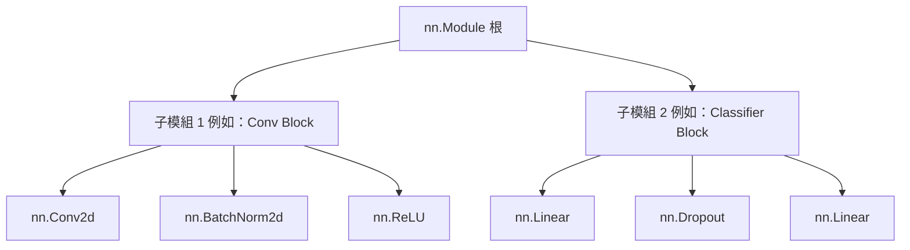

# `nn.Module` 深入探討

在 PyTorch 中，神經網路是使用 `torch.nn` 套件建構的。`nn.Module` 是所有神經網路模組的基礎類別。神經網路本身也是一個包含其他模組（層）的模組。這種巢狀結構允許複雜的架構，同時保持程式碼簡潔且易於偵錯。

## 建構自訂模型

PyTorch 中的每個自訂模型都必須繼承自 `nn.Module`。

您必須定義兩個方法：
1. `__init__`：定義層（例如 `nn.Linear`，`nn.Conv2d`）和模型的其他屬性。
2. `forward`：定義前向傳播邏輯，即輸入資料如何通過各層以生成輸出。

### 基本前饋網路

```python
import torch
from torch import nn

class NeuralNetwork(nn.Module):
    def __init__(self):
        super(NeuralNetwork, self).__init__()
        self.flatten = nn.Flatten()
        self.linear_relu_stack = nn.Sequential(
            nn.Linear(28*28, 512),
            nn.ReLU(),
            nn.Linear(512, 512),
            nn.ReLU(),
            nn.Linear(512, 10),
        )

    def forward(self, x):
        x = self.flatten(x)
        logits = self.linear_relu_stack(x)
        return logits
```

:::info
您不需要明確定義反向傳播（如何計算梯度）。PyTorch 的 `autograd` 系統會自動計算 `forward` 傳播中定義的操作的梯度。
:::

## 核心 `nn.Module` 概念

### 參數 (`Parameters`) 和緩衝區 (`Buffers`)

- **參數 (`nn.Parameter`)**：被註冊為模型屬性並在訓練期間由最佳化器更新的張量（例如權重和偏差）。
- **緩衝區**：被註冊為模型屬性但 *不* 需要梯度且 *不* 由最佳化器更新的張量（例如 `BatchNorm` 中的移動平均值和變異數）。

```python
for name, param in model.named_parameters():
    print(f"Layer: {name} | Size: {param.size()} | Requires Grad: {param.requires_grad}")
```

### 模組狀態管理 (`state_dict`)

`state_dict` 只是一個將每個層對應到其參數張量的 Python 字典物件。因為 `state_dict` 物件是 Python 字典，所以它們可以很容易地被儲存、更新、修改和恢復。

```python
# 儲存模型權重
torch.save(model.state_dict(), "model_weights.pth")

# 載入模型權重
model.load_state_dict(torch.load("model_weights.pth"))
```

### 訓練和評估模式

模型的行為取決於它是在訓練還是在評估（例如 `Dropout` 和 `BatchNorm` 層）。

```python
model.train() # 將模型設定為訓練模式
model.eval()  # 將模型設定為評估模式
```

## 內部架構層次



## 最佳實踐

- 始終在自訂模組建構函式的開頭呼叫 `super().__init__()`。
- 對於簡單的線性層堆疊使用 `nn.Sequential`，以保持 `forward` 函式整潔。
- 確保所有涉及張量的自訂操作，如果需要反向傳播，則都是完全可微的。

## 參考資料

- [PyTorch 官方教學：Build the Neural Network](https://pytorch.org/tutorials/beginner/basics/buildmodel_tutorial.html)
- [PyTorch 文件：torch.nn](https://pytorch.org/docs/stable/nn.html)
