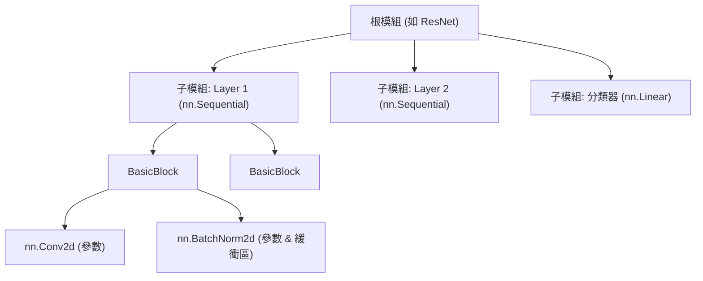

# nn.Module

`nn.Module` 是 PyTorch 中所有可微計算單元的基礎抽象。它的核心目的是將**狀態**（參數與緩衝區）和**計算**（前向傳播）封裝成一個統一的、可組合的物件。

一個 module 並不只是「某一層程式碼」，而是一個帶狀態的建構區塊，它與 PyTorch 的自動求導（autograd）引擎、最佳化器（optimizer）、模型序列化和設備遷移機制緊密整合。

## 核心設計哲學

`nn.Module` 的架構設計圍繞著三個核心原則展開：

### 狀態封裝與自動註冊（Stateful Registration）
模組內部負責管理三類狀態：可學習參數（parameters）、非學習的持久狀態（buffers）以及子模組（submodules）。透過覆寫 Python 的 `__setattr__`，PyTorch 會在賦值時自動將這些物件路由至內部的字典（`_parameters`、`_buffers`、`_modules`）中。正是這種自動註冊機制，支撐了 `model.parameters()`、`model.to(device)` 和 `model.state_dict()` 等介面的遞迴遍歷。

### 計算圖建構與 Autograd 整合（Differentiable Forward）
`forward` 方法定義了前向計算的數學映射 $f_\theta: \mathcal{X} \rightarrow \mathcal{Y}$。當你在程式碼中直接呼叫模組實例（即 `model(x)`）時，實際觸發的是底層的 `__call__` 方法。它會先執行已註冊的 hook（鉤子函式），檢查 `self.training` 狀態，最後再將呼叫派發至你實作的 `forward`。在這個過程中，Autograd 引擎會動態建構計算圖，確保梯度流 $\frac{\partial \mathcal{L}}{\partial \theta}$ 能夠沿著模組層級無縫反向傳播。

### 組合式架構（Compositional Hierarchy）
模組可以嵌套任意深度的子模組，從而形成一棵樹狀結構。這種設計完美契合了現代深度神經網路的模組化範式（如 Transformer 的 block，或是 ResNet 的 stage），極大地便利了權重共享、局部替換以及特徵擷取。



## 最小化實作

一個合法的最小化自訂模組只需要做三件事：繼承 `nn.Module`、在初始化方法中呼叫父類別的 `__init__()`，以及實作 `forward` 前向計算。

```python
import torch
import torch.nn as nn

class MinimalModule(nn.Module):
    def __init__(self, in_dim: int, out_dim: int):
        super().__init__() # 關鍵：初始化內部用於註冊和追蹤的字典
        self.linear = nn.Linear(in_dim, out_dim)

    def forward(self, x: torch.Tensor) -> torch.Tensor:
        return self.linear(x)
```

:::danger[不要忘記 `super().__init__()`]
絕對不要省略 `super().__init__()`。如果沒有這行程式碼，內部字典（如 `_parameters`、`_buffers` 等）將不會被初始化。後續任何對模組或參數的賦值都會拋出 `AttributeError`。
:::

## 狀態註冊機制詳解

理解 PyTorch 如何追蹤狀態非常重要。它決定了最佳化器能否更新正確的權重，以及 `state_dict` 能否儲存正確的張量。

| 狀態類型 | 註冊方式 | 是否參與梯度計算 | 是否隨 `.to()` 遷移 | 是否存入 `state_dict` |
| :--- | :--- | :--- | :--- | :--- |
| **可學習參數** | `nn.Parameter(tensor)` | ✅ 是 | ✅ 是 | ✅ 是 |
| **持久緩衝區** | `self.register_buffer(name, tensor)` | ❌ 否 | ✅ 是 | ✅ 是 |
| **非持久緩衝區** | `self.register_buffer(name, tensor, persistent=False)` | ❌ 否 | ✅ 是 | ❌ 否 |
| **子模組** | `self.layer = nn.Module(...)` | 繼承子模組自身定義 | ✅ 是 | ✅ 是 |

:::note[何時應該使用緩衝區（Buffers）？]
對於那些前向計算必須依賴，但不希望被反向傳播更新的狀態，應當使用 `register_buffer`。典型的例子包括位置編碼（positional encoding）、注意力遮罩（attention mask）以及 BatchNorm 中的滑動平均值/變異數。

切記：不要直接把一個普通的 Tensor 作為屬性隨意掛載到 `self` 上（例如 `self.mask = torch.zeros(...)`），這樣會直接繞過 PyTorch 的註冊系統。
:::

## 建構與修改的最佳實踐

### 狀態與容器管理

記得要**顯式處理參數初始化**。 自訂層如果有特定參數，應該顯式初始化。你可以利用 `model.apply(init_weights)` 將初始化函式遞迴地應用到整棵模組樹上。

:::warning[禁止使用原生 Python 容器儲存子模組]
如果你寫了 `self.layers = [nn.Linear(...) for _ in range(N)]`，PyTorch 不會註冊它們，最佳化器也就根本「看不見」這些參數。你必須使用官方提供的 `nn.ModuleList`、`nn.ModuleDict`、`nn.ParameterList` 或 `nn.ParameterDict`。
:::

### 前向傳播的設計
- **永遠呼叫 `model(x)` 而不是 `model.forward(x)`。** 實例呼叫會自動處理 hook 的派發機制，而直接調 `forward()` 會繞過這些邏輯。
- **尊重 `self.training` 標誌。** 像 Dropout、BatchNorm 這樣的層，其行為會根據訓練模式和評估模式發生改變。務必只透過呼叫全域的 `model.train()` 和 `model.eval()` 來切換模式。
- **避免破壞 Autograd 的 in-place 操作。** 對需要梯度的葉子張量（leaf tensor）執行 `x += self.bias` 會引發 `RuntimeError`，因為這破壞了計算圖。優先使用 out-of-place 操作：`x = x + self.bias`。

### 設備、精度與模式一致性
- **動態的設備和類型推斷。** 禁止在 `__init__` 中硬編碼 `device='cuda'`。在前向計算中建立臨時張量時，應該始終跟隨輸入張量的設備和資料型別：
  `mask = torch.ones(B, L, device=x.device, dtype=x.dtype)`
- **`torch.compile` 的編譯友好性。** 如果你打算使用 `torch.compile()` 加速，應盡量避免在前向傳播中寫入強資料依賴的控制流（例如 `if x.sum() > 0:`）。改用靜態分支或 `torch.where`。

### 模型修改（模型手術）
做「模型手術」時（例如替換某個深層子模組），盡量避免遍歷 `named_modules()`。官方推薦使用 `get_submodule()` 和 `set_submodule()`。它們支援透過按嵌套深度解析點分路徑（例如 `layer1.0.conv1`）來工作，非常適合做定點的檢查和替換。

## 總結

`nn.Module` 的最小職責邊界，是聲明當前這個局部網路擁有哪些狀態，並定義這些狀態如何參與前向計算。它並不負責訓練迴圈本身（取資料、算 loss、step），但它負責讓最佳化器、儲存載入機制、設備遷移、訓練/評估模式以及 hook 系統都能統一、遞迴地「看見」並管理這個模組的狀態。

## 參考資料

- [PyTorch 官方文件: torch.nn](https://pytorch.org/docs/stable/nn.html)
- [PyTorch 教學: Build the Neural Network](https://pytorch.org/tutorials/beginner/basics/buildmodel_tutorial.html)
