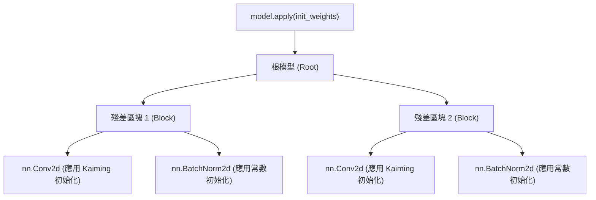

# 自訂層

雖然 PyTorch 提供了極其豐富的標準層函式庫（如 `nn.Linear`、`nn.Conv2d`），但前沿的深度學習研究往往需要定義各種新穎的數學運算。建構一個自訂層並不僅僅是寫一個 `forward` 函式這麼簡單——它要求你嚴謹地管理可學習參數，並採取科學的權重初始化策略。

## 自訂層的解剖學

建構自訂層在結構上與建構完整的模型完全一致：都需要繼承 `nn.Module`。核心的差別在於，你需要手動定義並註冊該層內部的張量（Tensors）。

### 顯式的參數註冊

當你將一個普通的張量賦值給模組的屬性時，PyTorch 只會將其視為一個標準的 Python 物件。為了讓這個張量融入 Autograd 引擎並被最佳化器追蹤，你必須顯式地將其包裝為 `nn.Parameter`。

```python
import torch
import torch.nn as nn
import math

class CustomProjection(nn.Module):
    def __init__(self, in_features: int, out_features: int):
        super().__init__()
        # 將張量包裝為 nn.Parameter，使其成為可學習、可追蹤的參數
        self.weight = nn.Parameter(torch.empty((out_features, in_features)))
        self.bias = nn.Parameter(torch.empty(out_features))
        
        self.reset_parameters()

    def reset_parameters(self):
        # 初始化邏輯應當被封裝在這裡
        nn.init.kaiming_uniform_(self.weight, a=math.sqrt(5))
        nn.init.zeros_(self.bias)

    def forward(self, x: torch.Tensor) -> torch.Tensor:
        return torch.nn.functional.linear(x, self.weight, self.bias)
```

:::tip[重置參數的慣例]
將所有的參數初始化邏輯封裝在 `reset_parameters()` 方法中，是 PyTorch 程式碼庫的一個非正式但被廣泛採納的慣例。這使得你可以在不重新實例化物件的情況下，隨時重置層的權重。
:::

## 初始化的數學原理

初始化絕不僅僅是一個普通的超參數；它決定了一個深度網路到底能不能被訓練。糟糕的初始化會直接導致梯度的**消失**或**爆炸**。

### 為什麼初始化如此重要？

考慮一個深層線性網路，其中第 $l$ 層的前向傳播為 $h^{(l)} = W^{(l)} h^{(l-1)}$。如果權重的變異數沒有經過精心縮放，激勵值的變異數將隨著網路的深度呈指數級放大或縮小：

$$
\text{Var}(h^{(l)}) = n \cdot \text{Var}(W^{(l)}) \cdot \text{Var}(h^{(l-1)})
$$

這裡的 $n$ 是 fan-in（輸入單元的數量）。為了保持變異數穩定（$\text{Var}(h^{(l)}) \approx \text{Var}(h^{(l-1)})$），我們需要 $n \cdot \text{Var}(W^{(l)}) = 1$，即權重的變異數應當為 $\text{Var}(W) = \frac{1}{n}$。

### 經典初始化策略

1. **Xavier (Glorot) 初始化**：專為 `tanh` 等對稱激勵函式設計。它綜合考慮了輸入和輸出的維度來縮放權重。
2. **Kaiming (He) 初始化**：專為 ReLU 等非對稱非線性激勵函式設計。因為 ReLU 會將一半的激勵值歸零（削減了一半的變異數），Kaiming 初始化將變異數乘以 2 來進行補償：$\text{Var}(W) = \frac{2}{n_{in}}$。

:::warning[警惕初始化不匹配]
如果在 ReLU 激勵函式前使用 Xavier 初始化，訊號的變異數會在每一層被系統性地減半，這在深層網路中會迅速引發梯度消失。請務必讓你的初始化方案與激勵函式嚴格匹配。
:::

## 系統性的初始化應用

在實際工程中，我們很少去逐個層呼叫初始化函式。PyTorch 提供了 `model.apply(fn)` 方法，它會以深度優先的方式遞迴遍歷模組樹中的每一個節點（包括根節點本身），並對其應用傳入的 `fn` 函式。



### Apply 派發模式

透過定義一個根據層類型進行派發（Dispatch）的函式，你可以極其優雅地完成整個架構的參數初始化：

```python
import torch.nn.init as init

def init_weights(m: nn.Module):
    if isinstance(m, nn.Conv2d) or isinstance(m, nn.Linear):
        # 對後接 ReLU 的層使用 Kaiming 常態分布初始化
        init.kaiming_normal_(m.weight, mode='fan_in', nonlinearity='relu')
        if m.bias is not None:
            init.zeros_(m.bias)
    elif isinstance(m, nn.BatchNorm2d) or isinstance(m, nn.LayerNorm):
        # 正規化層：縮放設為 1，偏移設為 0
        init.ones_(m.weight)
        init.zeros_(m.bias)

# 執行遞迴初始化
model.apply(init_weights)
```

## 總結

自訂層賦予了你對數學運算的絕對控制權，但隨之而來的是正確註冊和初始化參數的責任。請永遠記住將可學習的張量包裝在 `nn.Parameter` 中，利用 `reset_parameters` 封裝初始化邏輯，並使用 `model.apply` 來執行穩健的、全域的初始化策略。

## 參考資料

- [PyTorch 官方文件: torch.nn.init](https://pytorch.org/docs/stable/nn.init.html)
- [He 等 (2015): Delving Deep into Rectifiers](https://arxiv.org/abs/1502.01852)
- [Glorot & Bengio (2010): Understanding the difficulty of training deep feedforward neural networks](https://proceedings.mlr.press/v9/glorot10a.html)
