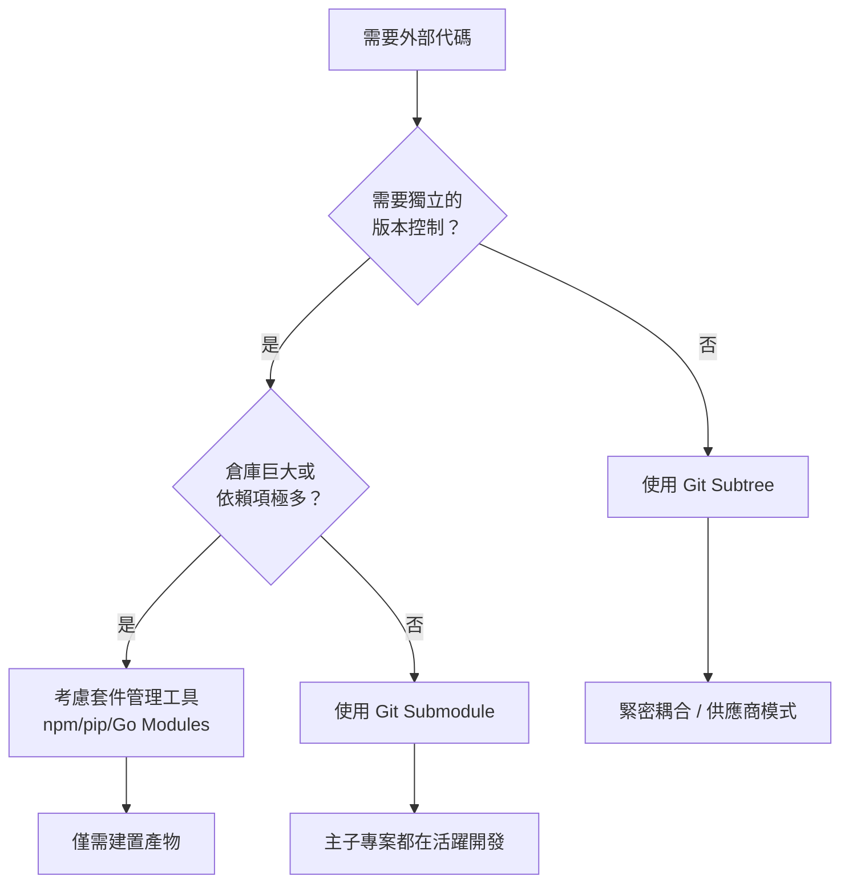

# Git 組合策略

**在 Submodule 與 Subtree 之間做出明智選擇**

在實施具體的技術方案之前，請先評估最適合你專案的開發哲學。這通常取決於你將外部代碼視為一個獨立的依賴項（如外部引用），還是專案源碼的集成部分（如受管理的 Fork）。

---

## 決策邏輯

下表概述了兩種方案之間的主要權衡點：

| 維度 | Submodule（分離） | Subtree（合入） |
| :--- | :--- | :--- |
| **心智模型** | **外部引用**：指向外部倉庫的指標 | **受控 Fork**：代碼被合併入你的倉庫 |
| **哲學** | "依賴即指標" | "依賴即源碼" |
| **修改頻率** | 很少 — 依賴獨立維護 | 經常 — 依賴被視為專案一部分 |
| **更新頻率** | 低 — 有計畫地升級 | 高 — 在功能開發中同時變更 |
| **同步成本** | 高 — 兩步流程（子倉庫 + 指標更新） | 低 — 單次提交即可覆蓋主倉庫與依賴 |
| **入門成本** | 高 — 需學習 Submodule 工作流 | 低 — 標準 Git 工作流即可 |
| **CI/CD** | 需要遞迴克隆/初始化 | 無需額外配置 |

### 簡短建議

- **優先選擇 Submodule**：如果依賴項是獨立維護的（例如穩定的公共庫），且你僅需偶爾升級。它就像是一個指向特定版本的 **連結**。
- **優先選擇 Subtree**：如果團隊在開發特性時經常需要修補或演進依賴代碼。它就像是將代碼直接 **Fork** 到你的倉庫中，使一切集中管理。

---

## 架構適配性

使用以下指南確定你的需求在 Git 生態中的位置：

---

## 方案對比矩陣

| 維度 | Submodule | Git Subtree | 套件管理工具 (npm/pip) |
| :--- | :--- | :--- | :--- |
| **存儲方式** | 指向提交雜湊的指標 | 完整代碼合併入主倉庫 | 通常僅限建置產物 |
| **工作流** | 較高 (init/update) | 較低 (普通 Git 操作) | 託管式 (npm/pip) |
| **歷史記錄** | 分離 | 合併 | 無（源碼被隱藏） |
| **CI/CD** | 需要遞迴克隆 | 無需額外配置 | 需要私有倉庫/安裝步驟 |
| **回推上游** | 非常簡單 | 較慢（需 split/push） | 透過發佈流程 |
