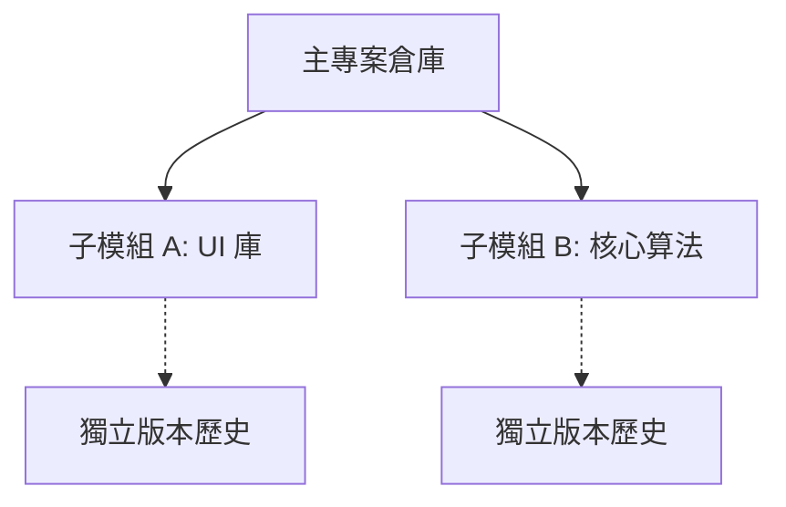

# Git Submodule 完整指南

**管理外部依賴與多倉庫架構**

Git Submodule 允許你將一個 Git 倉庫作為另一個 Git 倉庫的子目錄。這讓你可以在專案中包含另一個倉庫，並保持提交歷史的分離。

---

## 核心概念

### 架構概覽



| 用例 | 描述 | 範例 |
| :--- | :--- | :--- |
| **依賴管理** | 包含第三方庫的特定版本。 | 鎖定 UI 框架版本。 |
| **元件重用** | 在多個專案間共享公共元件。 | 共享的認證/日誌模組。 |
| **微服務** | 在單一視圖中組織相關服務。 | 開發環境的統一編排。 |

---

## 基礎操作

### 新增 Submodule

```bash
# 在指定路徑新增 Submodule
git submodule add <repository_url> <path>

# 範例：新增通用工具庫
git submodule add https://github.com/example/tools.git libs/tools
```

### 克隆包含 Submodule 的專案

```bash
# 方法 A：一步克隆（推薦）
git clone --recurse-submodules <url>

# 方法 B：手動初始化
git clone <url>
cd project
git submodule update --init --recursive
```

### 更新 Submodule

| 任務 | 指令 |
| :--- | :--- |
| **同步到記錄的提交** | `git submodule update` |
| **更新到遠端最新** | `git submodule update --remote` |
| **遞迴更新所有** | `git submodule update --init --recursive` |

---

## 開發工作流

當你需要在 Submodule 內部進行修改時：

1. **進入 Submodule**: `cd libs/tools`
2. **切換分支**: `git checkout main` (避免處於游離 HEAD 狀態)。
3. **修改並提交**: `git add . && git commit -m "feat: update tools"`
4. **推送 Submodule**: `git push origin main`
5. **在主專案中記錄更新**:
   ```bash
   cd ../..
   git add libs/tools
   git commit -m "chore: update tools submodule pointer"
   git push origin main
   ```

---

## 最佳實踐

:::info[工程建議]
1. **鎖定版本**: 除非有特殊需求，否則應鎖定到具體提交，確保建置可重複。
2. **使用 HTTPS**: 在 `.gitmodules` 中優先使用 HTTPS 連結，提高 CI/CD 相容性。
3. **主動同步**: 養成 `git pull` 後執行 `git submodule update --init --recursive` 的習慣。
4. **清理殘留**: 刪除 Submodule 時，除 `git rm` 外，還需清理 `.git/modules/` 下的快取。

:::

---

## 故障排查

| 問題 | 解決方案 |
| :--- | :--- |
| **游離 HEAD 狀態** | `cd <path> && git checkout <branch>`。 |
| **URL 發生變更** | 修改 `.gitmodules` 後執行 `git submodule sync`。 |
| **合併衝突** | 使用 `git checkout --ours/--theirs <path>` 選取指標版本並重新提交。 |
