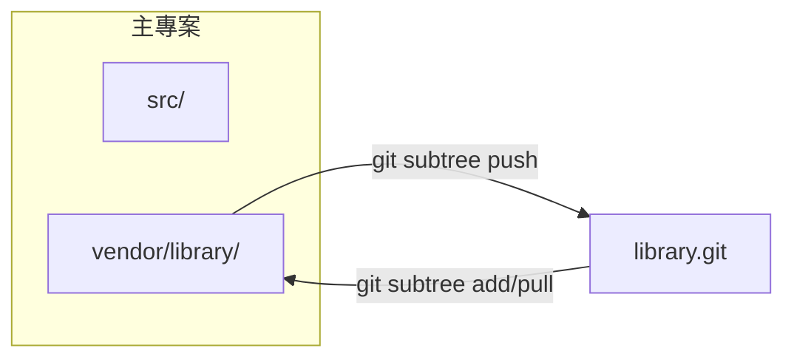

# Git Subtree 完整指南

**在專案中嵌入外部倉庫，無需獨立指標檔案**

Git subtree 允許你將另一個倉庫合併到專案的子目錄中，同時保留從上游拉取更新以及推送變更的能力。與 `git submodule` 不同，它不需要 `.gitmodules` 檔案——外部程式碼直接存在於你自己的提交歷史中。

---

## 核心概念

### Subtree 的運作原理




從本質上講，`git subtree` 會將外部倉庫合併到指定的前綴目錄中。可選擇保留完整歷史或透過 `--squash` 壓縮為單個提交以保持日誌整潔。

---

## 基礎操作

### 新增 Subtree

```bash
# 通用語法
git subtree add --prefix=<路徑> <倉庫URL> <分支> [--squash]

# 範例：將工具函式庫嵌入到 vendor/tools
git subtree add --prefix=vendor/tools https://github.com/example/tools.git main --squash
```

| 參數 | 作用 |
| :--- | :--- |
| `--prefix` | 工作樹中的目標目錄（不存在時會自動建立） |
| `--squash` | 將外部歷史壓縮為單個合併提交（建議，保持日誌整潔） |
| `<分支>` | 要匯入的遠端分支（`main`、`master`、`develop` 等） |

### 拉取上游更新

```bash
# 將遠端最新變更拉取到指定前綴目錄
git subtree pull --prefix=vendor/tools https://github.com/example/tools.git main --squash
```

:::info
`git subtree pull` 內部執行的是 `git merge`。如有衝突，按照標準 Git 衝突解決流程處理即可。
:::

---

## 開發工作流程

### 場景：匯入函式庫並做本地修改

1. **新增 Subtree**（一次性設定）:
   `git subtree add --prefix=vendor/log https://github.com/user/log.git main --squash`

2. **在本地修改函式庫**:
   直接編輯 `vendor/log/` 下的檔案。

3. **在主倉庫中提交修改**:
   `git add vendor/log && git commit -m "vendor(log): 修復解析器記憶體洩漏"`

4. **將變更推送回上游**（需有寫入權限）:
   `git subtree push --prefix=vendor/log https://github.com/user/log.git main`

---

## 最佳實踐

### 常用模式

- **保持前綴路徑清晰可預測**: 將 Subtree 組織在 `vendor/` 或 `packages/` 下。
- **一致使用 `--squash`**: 混用 squash 會導致歷史混亂。
- **避免深層嵌套**: Subtree 內再套 Subtree 會導致不可預測的合併行為。
- **提交訊息規範**: 使用 `vendor(<名稱>):` 前綴方便過濾歷史。

---

## 疑難排解

| 問題 | 解決方案 |
| :--- | :--- |
| **`subtree push` 極慢** | 在新克隆中執行，或先 split 再推送。 |
| **`subtree pull` 合併衝突** | 正常解決衝突（`git add <file> && git commit`）。 |
| **前綴目錄用錯了** | 用正確前綴重新 add，然後刪除舊目錄。 |
| **需要移除 Subtree** | `git rm -r <prefix> && git commit -m "remove subtree <name>"`。 |

---

## 遷移指南

### 從 Submodule 遷移到 Subtree

```bash
# 1. 移除 Submodule
git submodule deinit vendor/library
git rm vendor/library
rm -rf .git/modules/vendor/library
git commit -m "chore: 移除 Submodule vendor/library"

# 2. 新增為 Subtree
git subtree add --prefix=vendor/library https://github.com/user/library.git main --squash
```

---

## 參考資料

- [Pro Git -- Git Tools - Subtree Merging](https://git-scm.com/book/en/v2/Git-Tools-Subtree-Merging)
- [git-subtree 文件（內建）](https://git.wiki.kernel.org/index.php/Git-subtree)
- [Atlassian 教學 -- Git Subtree](https://www.atlassian.com/git/tutorials/git-subtree)
