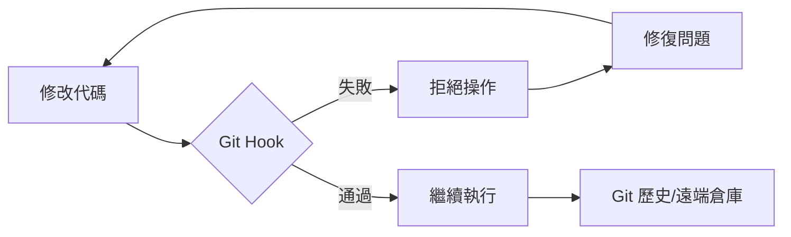

# Git Hooks 工程指南

**自動化工作流並強制執行工程標準**

Git hooks 是 Git 在關鍵事件（如 commit, push, receive）前後自動執行的腳本。它們對於維護代碼質量、確保安全性以及自動化重複性的開發任務至關重要。

## 核心概念

### Hook 分類

| 類別 | Hooks | 作用範圍 |
| :--- | :--- | :--- |
| **客戶端 (Client-Side)** | `pre-commit`, `commit-msg`, `pre-push` | 本地開發工作流 |
| **服務端 (Server-Side)** | `pre-receive`, `post-receive`, `update` | 遠端倉庫強制執行 |

### 客戶端與服務端 Hooks 的區別

**客戶端 Hooks** 在開發者的本地機器上運行。它們充當個人防護欄 — 執行快速的 linting、格式化和提交信息驗證等檢查。客戶端 Hooks 可以通過 `--no-verify` 跳過，因此屬於建議性而非強制性。

**服務端 Hooks** 在遠端倉庫（如 GitHub、GitLab、自建 Git 伺服器）上運行。它們強制執行不可跳過的策略，例如拒絕未通過 CI 檢查的推送、強制執行分支命名規範，或禁止對受保護分支執行 force-push。

> **經驗法則**：客戶端 Hooks 用於提升開發體驗（快速反饋），服務端 Hooks 用於策略執行（不可繞過的規則）。

### 為什麼要使用 Hooks 自動化？



| 收益 | 工程成果 |
| :--- | :--- |
| **代碼質量** | 防止 linting/formatting 錯誤進入版本庫。 |
| **安全性** | 在代碼離開本地機器前掃描硬編碼的密鑰（Secrets/API keys）。 |
| **標準化** | 強制執行 [Conventional Commits](https://www.conventionalcommits.org/) 規範。 |
| **可靠性** | 確保單元測試通過後才允許執行 push 操作。 |

---

## Hook 管理工具

原生 Git hooks（存儲在 `.git/hooks/` 中）不易進行版本控制。Hook 管理工具通過使 hooks 可共享、可配置且易於維護來解決這一問題。根據項目的生態系統選擇合適的工具：

| 管理工具 | 語言 | 適用場景 | 並行執行 |
| :--- | :--- | :--- | :--- |
| **Husky** + lint-staged | Node.js | npm/Node.js 項目 | 通過 lint-staged |
| **[Lefthook](https://github.com/evilmartians/lefthook)** | Go 二進制 | 多語言 / 任意工具鏈 | 內建支持 |
| **[pre-commit](https://pre-commit.com)** | Python | Python 或多語言倉庫 | 不支持 |

### Husky + lint-staged (Node.js 生態)

Husky 簡化了 Git hooks 的管理和在團隊內的共享。

```bash
# 安裝 Husky
npm install husky --save-dev

# 初始化 Husky (創建 .husky 目錄)
npx husky init
```

在每次 commit 時對 *整個* 代碼庫運行 linter 會非常緩慢。`lint-staged` 確保你只檢查當前正在提交的文件。

```bash
npm install lint-staged --save-dev
```

**配置 (`package.json`):**

```json
{
  "lint-staged": {
    "*.{js,ts,tsx}": "eslint --fix",
    "*.py": "ruff check --fix",
    "*.md": "prettier --write"
  }
}
```

**.husky/pre-commit:**

```bash
npx lint-staged
```

### Lefthook (語言無關)

一個用 Go 編寫的快速、零依賴的管理工具。與 Husky（僅限 npm）或 pre-commit（Python）不同，Lefthook 適用於任何工具鏈，並內建支持並行執行。

**安裝：**

```bash
# Go
go install github.com/evilmartians/lefthook@latest

# npm
npm install @evilmartians/lefthook --save-dev

# Homebrew (macOS/Linux)
brew install lefthook
```

**配置 (`lefthook.yml`):**

```yaml
pre-commit:
  commands:
    lint-js:
      glob: "*.{js,ts,tsx}"
      run: eslint --fix {staged_files}

    format-py:
      glob: "*.py"
      run: ruff format {staged_files}

commit-msg:
  commands:
    conventional:
      run: commitlint --edit {1}
```

```bash
# 將 hooks 安裝到 .git/ 目錄
lefthook install
```

### pre-commit (Python 生態)

純 Python 或多語言項目的行業標準，擁有豐富的共享 hook 倉庫生態。

```bash
pip install pre-commit
```

**`.pre-commit-config.yaml`:**

```yaml
repos:
  - repo: https://github.com/pre-commit/pre-commit-hooks
    rev: v4.6.0
    hooks:
      - id: trailing-whitespace
      - id: end-of-file-fixer
      - id: check-yaml
      - id: check-added-large-files

  - repo: https://github.com/astral-sh/ruff-pre-commit
    rev: v0.4.0
    hooks:
      - id: ruff
        args: [ --fix ]
      - id: ruff-format
```

```bash
# 將 hooks 安裝到 .git/ 目錄
pre-commit install

# 手動對所有文件運行
pre-commit run --all-files
```

---

## 提交信息工具

標準化的提交信息有助於自動生成變更日誌（Changelog）並提供更好的項目歷史視圖。這些工具通過 `commit-msg` hook 接入任何 Hook 管理工具。

### Commitlint (驗證)

在提交信息寫入後強制執行 Conventional Commit 規範：

```bash
npm install @commitlint/cli @commitlint/config-conventional --save-dev

# 創建配置
echo "export default { extends: ['@commitlint/config-conventional'] };" > commitlint.config.js

# 添加 hook
echo "npx commitlint --edit \$1" > .husky/commit-msg
```

### Commitizen (交互式)

**[Commitizen](https://commitizen-tools.github.io/commitizen/)** 通過交互式引導幫助開發者編寫合規的提交信息 — 在驗證之前就消除猜測。

```bash
npm install cz-conventional-changelog --save-dev
```

**`package.json`:**

```json
{
  "scripts": {
    "commit": "cz"
  },
  "config": {
    "commitizen": {
      "path": "cz-conventional-changelog"
    }
  }
}
```

使用 `npm run commit`（或 `npx cz`）替代 `git commit`，系統將交互式地引導你填寫 type、scope 和 description。

> 兩者配合實現縱深防禦：Commitizen 幫助編寫規範的提交信息，Commitlint 捕獲任何遺漏。

---

## 最佳實踐

:::tip 主動驗證 (Proactive Validation)
1. **對 Hooks 進行版本控制**：永遠不要依賴本地的 `.git/hooks/`。請使用 Hook 管理工具。
2. **快速失敗 (Fail Fast)**：合理安排 hooks 順序，使運行速度最快的檢查（如 linting）先於耗時較長的檢查（如集成測試）運行。
3. **信息化錯誤提示**：確保 hook 腳本在拒絕提交時提供清晰的修復指南。
4. **謹慎使用 `--no-verify`**：僅在緊急情況下跳過 hooks；絕不要為了規避質量標準而使用。
5. **虛擬環境感知**：Hooks 在裸 shell 環境中執行 — 不會繼承你激活的虛擬環境。請使用 `uv run`、`pipx run` 等包裝命令或絕對路徑來確保工具能被找到。
:::

---

## 常見問題排除

| 問題 | 解決方案 |
| :--- | :--- |
| **Hooks 未觸發** | 確保腳本具有執行權限：`chmod +x .husky/pre-commit` |
| **Husky 初始化失敗** | 確保你位於 Git 倉庫的根目錄下。 |
| **環境不匹配** | 在 hook 腳本中使用絕對路徑或標準命令（如 `npm run`）。 |
| **"command not found" 錯誤** | Hook 在虛擬環境之外運行。請使用 `uv run`、`pipx run` 前綴或工具的絕對路徑。 |
