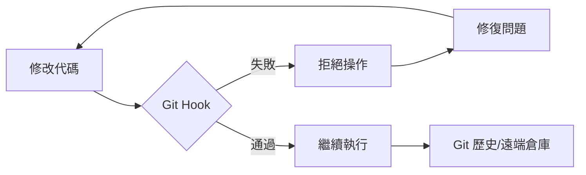

# Git Hooks 工程指南

**自動化工作流並強制執行工程標準**

Git hooks 是 Git 在關鍵事件（如 commit, push, receive）前後自動執行的腳本。它們對於維護代碼質量、確保安全性以及自動化重複性的開發任務至關重要。

## 核心概念

### Hook 分類

| 類別 | Hooks | 作用範圍 |
| :--- | :--- | :--- |
| **客戶端 (Client-Side)** | `pre-commit`, `commit-msg`, `pre-push` | 本地開發工作流 |
| **服務端 (Server-Side)** | `pre-receive`, `post-receive`, `update` | 遠端倉庫強制執行 |

### 為什麼要使用 Hooks 自動化？



| 收益 | 工程成果 |
| :--- | :--- |
| **代碼質量** | 防止 linting/formatting 錯誤進入版本庫。 |
| **安全性** | 在代碼離開本地機器前掃描硬編碼的密鑰（Secrets/API keys）。 |
| **標準化** | 強制執行 [Conventional Commits](https://www.conventionalcommits.org/) 規範。 |
| **可靠性** | 確保單元測試通過後才允許執行 push 操作。 |

---

## 標準工具鏈：Husky & lint-staged

雖然原生 Git hooks（存儲在 `.git/hooks/` 中）非常強大，但它們不易進行版本控制。對於現代工程團隊，我們標準化使用 **Husky**。

### 1. 設置 Husky (Node.js/通用)

Husky 簡化了 Git hooks 的管理和在團隊內的共享。

```bash
# 安裝 Husky
npm install husky --save-dev

# 初始化 Husky (創建 .husky 目錄)
npx husky init
```

### 2. 使用 lint-staged 進行優化

在每次 commit 時對 *整個* 代碼庫運行 linter 會非常緩慢。`lint-staged` 確保你只檢查當前正在提交的文件。

```bash
npm install lint-staged --save-dev
```

**配置 (`package.json`):**

```json
{
  "lint-staged": {
    "*.{js,ts,tsx}": "eslint --fix",
    "*.py": "ruff check --fix",
    "*.md": "prettier --write"
  }
}
```

**.husky/pre-commit:**

```bash
npx lint-staged
```

---

## 提交信息標準化 (Commit Message Standardization)

標準化的提交信息有助於自動生成變更日誌（Changelog）並提供更好的項目歷史視圖。

### Commitlint

強制執行 Conventional Commit 規範：

```bash
npm install @commitlint/cli @commitlint/config-conventional --save-dev

# 創建配置
echo "export default { extends: ['@commitlint/config-conventional'] };" > commitlint.config.js

# 添加 hook
echo "npx commitlint --edit \$1" > .husky/commit-msg
```

---

## Python 工程：Pre-commit 框架

對於純 Python 或多語言項目，`pre-commit` 框架是行業標準。

### 安裝與配置

```bash
pip install pre-commit
```

**`.pre-commit-config.yaml`:**

```yaml
repos:
  - repo: https://github.com/pre-commit/pre-commit-hooks
    rev: v4.6.0
    hooks:
      - id: trailing-whitespace
      - id: end-of-file-fixer
      - id: check-yaml
      - id: check-added-large-files

  - repo: https://github.com/astral-sh/ruff-pre-commit
    rev: v0.4.0
    hooks:
      - id: ruff
        args: [ --fix ]
      - id: ruff-format
```

### 使用方法

```bash
# 將 hooks 安裝到 .git/ 目錄
pre-commit install

# 手動對所有文件運行
pre-commit run --all-files
```

---

## 最佳實踐

:::tip 主動驗證 (Proactive Validation)
1. **對 Hooks 進行版本控制**：永遠不要依賴本地的 `.git/hooks/`。請使用 Husky 或 `pre-commit`。
2. **快速失敗 (Fail Fast)**：合理安排 hooks 順序，使運行速度最快的檢查（如 linting）先於耗時較長的檢查（如集成測試）運行。
3. **信息化錯誤提示**：確保 hook 腳本在拒絕提交時提供清晰的修復指南。
4. **謹慎使用 `--no-verify`**：僅在緊急情況下跳過 hooks；絕不要為了規避質量標準而使用。
:::

---

## 常見問題排除

| 問題 | 解決方案 |
| :--- | :--- |
| **Hooks 未觸發** | 確保腳本具有執行權限：`chmod +x .husky/pre-commit` |
| **Husky 初始化失敗** | 確保你位於 Git 倉庫的根目錄下。 |
| **環境不匹配** | 在 hook 腳本中使用絕對路徑或標準命令（如 `npm run`）。 |

