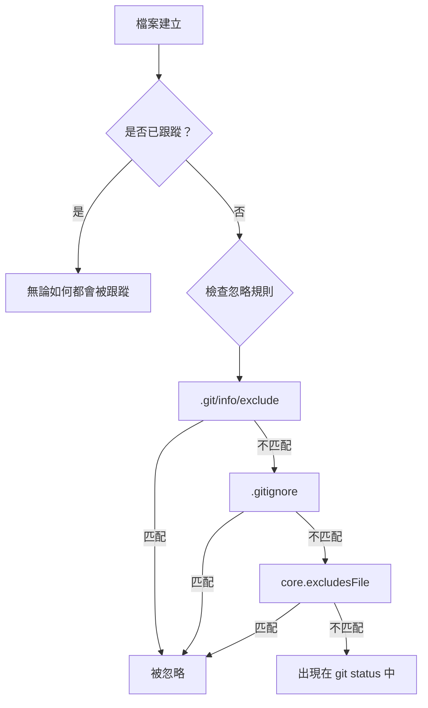
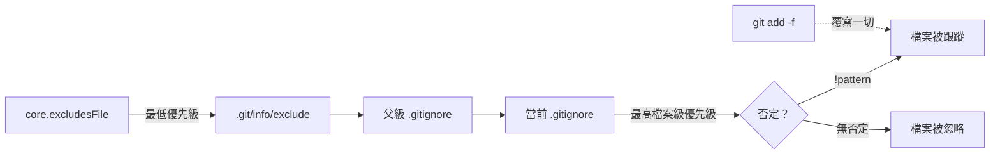

# Git Ignore 工程指南

**在專案、本地和全域範圍內管理未跟蹤檔案**

Git 提供三個層級的忽略配置，用於控制哪些檔案被排除在版本控制之外。理解何時何地使用每個層級，對於保持儲存庫整潔和高效的團隊協作至關重要。

## 忽略層級概覽

| 層級 | 檔案 / 配置 | 作用範圍 | 是否共用？ | 使用場景 |
| :--- | :--- | :--- | :--- | :--- |
| **專案級** | `.gitignore` | 整個儲存庫 | 是（已提交） | 建構產物、依賴、IDE 設定 |
| **本地級** | `.git/info/exclude` | 單個本地儲存庫 | 否 | 個人編輯器檔案、本地腳本 |
| **全域級** | `core.excludesFile` | 使用者所有儲存庫 | 否 | 系統檔案（`.DS_Store`）、編輯器備份 |



---

## 專案級：`.gitignore`

`.gitignore` 檔案會被提交到儲存庫，在所有協作者之間共用。它定義了適用於專案所有成員的忽略規則。

### 位置與作用範圍

- `.gitignore` 檔案對其所在目錄及所有子目錄遞迴生效。
- 可以在目錄樹的不同層級放置多個 `.gitignore` 檔案。
- 子目錄中 `.gitignore` 的規則優先級高於父目錄。

### 模式語法

| 模式 | 含義 | 範例 |
| :--- | :--- | :--- |
| `*.log` | 匹配當前目錄及子目錄下所有 `.log` 檔案 | `debug.log`、`error.log` |
| `build/` | 匹配 `build` 目錄及其所有內容 | `build/output.js` |
| `temp` | 匹配任意位置名為 `temp` 的檔案或目錄 | `temp/`、`src/temp` |
| `/temp` | 僅匹配根目錄下的 `temp`（前導斜錨定到 `.gitignore` 所在位置） | `temp/` 但不匹配 `src/temp` |
| `**/logs` | 匹配任意深度的 `logs` | `logs/`、`a/b/logs/` |
| `**/logs/**` | 匹配任意 `logs` 目錄下的所有內容 | `a/b/logs/x.txt` |
| `!important.log` | 否定：不忽略此檔案（覆寫之前的規則） | 重新包含特定檔案 |
| `doc/*.txt` | 僅匹配 `doc/` 下的 `.txt` 檔案（不含子目錄） | `doc/notes.txt` |
| `doc/**/*.txt` | 匹配 `doc/` 及其所有子目錄下的 `.txt` 檔案 | `doc/a/b/notes.txt` |

### 否定規則

使用 `!` 重新包含被更寬泛規則忽略的檔案：

```gitignore
# 忽略所有 .log 檔案
*.log

# 但不包括 important.log
!important.log
```

:::caution
否定規則僅在父目錄本身未被忽略時才有效。如果 `logs/` 已被忽略，`!logs/important.log` 不會生效 — Git 不會檢查已被忽略的目錄內部。
:::

### 常見專案模式

```gitignore
# 依賴
node_modules/
vendor/
.pnp/
.pnp.js

# 建構產物
dist/
build/
out/
*.o
*.pyc

# 環境變數和金鑰
.env
.env.*
!.env.example
*.pem
*.key

# IDE 和編輯器檔案
.vscode/
.idea/
*.swp
*.swo
*~

# 系統檔案
.DS_Store
Thumbs.db

# 日誌
*.log
npm-debug.log*
yarn-debug.log*
yarn-error.log*

# Python
__pycache__/
*.pyc
.pytest_cache/
.mypy_cache/

# Docusaurus / Node.js
.docusaurus/
.cache/
```

---

## 本地級：`.git/info/exclude`

`.git/info/exclude` 檔案位於特定儲存庫的 `.git` 目錄內。其功能與 `.gitignore` 完全相同，但**永遠不會被提交或共用**。

### 何時使用

- 不應放入專案 `.gitignore` 的個人 IDE 設定檔案
- 本地輔助腳本或草稿檔案
- 特定於個人工作流程的臨時檔案
- 與專案相關但對其他團隊成員無意義的檔案

### 位置

```
<儲存庫根目錄>/.git/info/exclude
```

### 範例

```gitignore
# 個人草稿檔案
scratch.md
notes/

# 不與團隊共用的本地編輯器設定
.local-editor-settings.json

# 不想污染 git status 的系統檔案
.DS_Store
```

:::tip
當檔案屬於專案特定但不應強制對整個團隊生效忽略規則時，使用 `.git/info/exclude`。這樣可以保持 `.gitignore` 簡潔，專注於通用模式。
:::

---

## 全域級：`core.excludesFile`

全域忽略適用於你機器上的**所有儲存庫**。設定一次，再也不用擔心系統或編輯器產生的干擾檔案。

### 設定

```bash
# 1. 建立全域忽略檔案
touch ~/.gitignore_global

# 2. 告訴 Git 使用它
git config --global core.excludesFile ~/.gitignore_global
```

### 推薦的全域模式

```gitignore
# macOS
.DS_Store
.AppleDouble
.LSOverride
._*

# Windows
Thumbs.db
ehthumbs.db
Desktop.ini

# Linux
*~
.directory

# 編輯器檔案
*.swp
*.swo
*~
.vscode/settings.json
.idea/workspace.xml

# 差異和合併工具备份
*.orig
*.rej
*.merge-file-backup

# Python
__pycache__/
*.pyc

# Node.js（如果參與多個 JS 專案）
node_modules/
```

### 驗證設定

```bash
# 查看當前全域 excludesFile 路徑
git config --global core.excludesFile

# 查看所有與忽略相關的設定
git config --global --get-regexp ignore
```

---

## 優先級與求值順序

Git 按以下順序求值忽略規則（後面的規則覆寫前面的規則）：

1. **命令列標誌** — `git add -f <file>` 強制跟蹤，無視任何忽略規則。
2. **`.gitignore` 規則** — 從當前目錄的檔案讀取，然後向上逐級讀取父目錄中的檔案。越近的檔案優先級越高。
3. **`.git/info/exclude`** — 本地儲存庫排除檔案。
4. **`core.excludesFile`** — 全域忽略檔案。

:::info
在單個 `.gitignore` 檔案內，**最後匹配的規則生效**。位於忽略模式之後的否定 `!pattern` 會重新包含匹配的檔案。
:::



---

## 已跟蹤的檔案永遠不會被忽略

一條關鍵規則：**Git 不會忽略已被跟蹤的檔案。** 如果檔案已被提交，將其加入 `.gitignore` 不會產生任何效果。

### 從索引中移除已跟蹤的檔案

```bash
# 從 Git 索引中移除但保留在磁碟上
git rm --cached <file>

# 遞迴移除目錄
git rm --cached -r <directory>

# 提交變更
git commit -m "chore: 停止跟蹤 <file>"
```

執行 `git rm --cached` 後，檔案變為未跟蹤狀態，`.gitignore` 規則將對其生效。

---

## 調試忽略規則

### 檢查檔案為何被忽略

```bash
git check-ignore -v <file>
```

輸出格式：

```
.gitignore:3:*.log    debug.log
```

這表示：`.gitignore` 檔案第 `3` 行，規則 `*.log`，匹配了檔案 `debug.log`。

### 檢查多個檔案

```bash
git check-ignore -v *.log *.tmp
```

### 查找所有被忽略的檔案

```bash
# 列出工作樹中所有被忽略的檔案
git status --ignored

# 列出詳細資訊
git ls-files --others --ignored --exclude-standard
```

---

## 最佳實踐

| 實踐 | 理由 |
| :--- | :--- |
| **盡早提交 `.gitignore`** | 防止意外提交建構產物或金鑰。 |
| **保持規則具體** | 使用明確模式而非寬泛萬用字元，避免意外。 |
| **個人檔案使用 `.git/info/exclude`** | 保持共用的 `.gitignore` 簡潔。 |
| **一次性設定全域忽略** | 消除所有儲存庫中的系統和編輯器干擾檔案。 |
| **在 `.gitignore` 中新增註解** | 按用途分組規則，用空行分隔各部分。 |
| **不要用 `.gitignore` 忽略應放入 `.git/info/exclude` 的內容** | 個人工作流程檔案不應強加給團隊。 |
| **使用 `git check-ignore -v` 調試** | 快速定位忽略某個檔案的規則來源。 |
