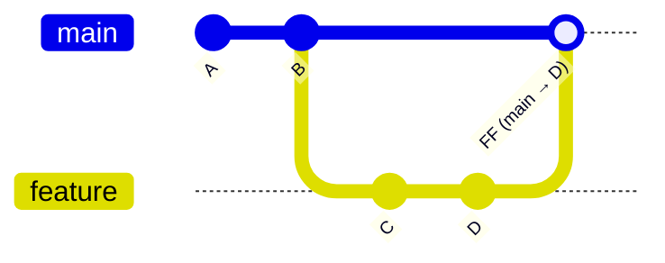
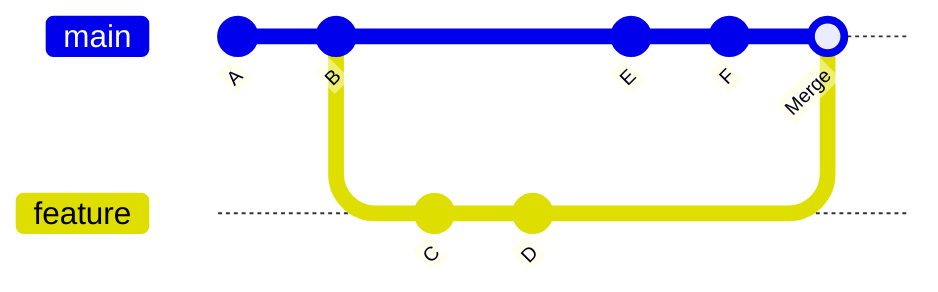
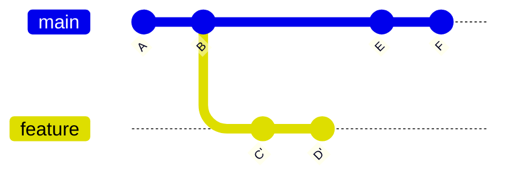
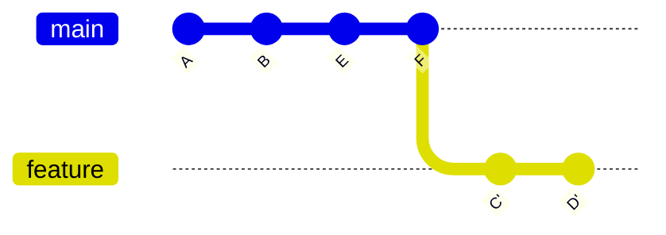
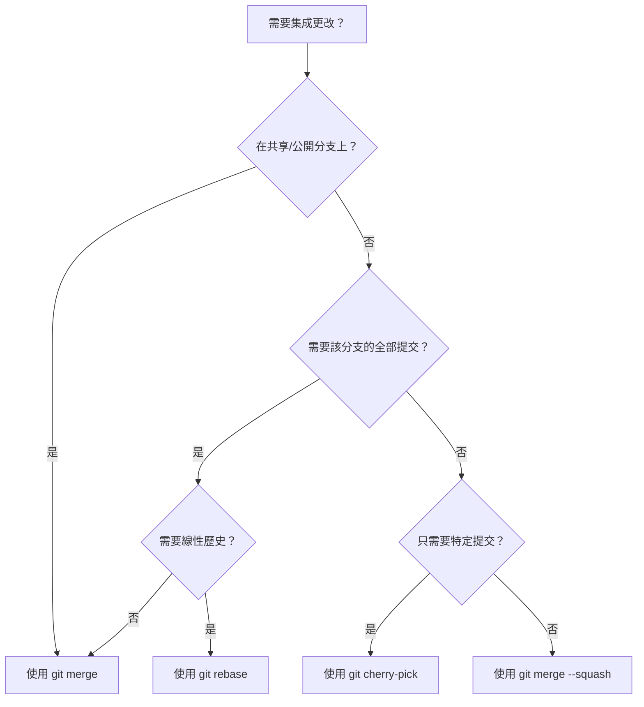

# Merge、Rebase 與 Cherry-Pick

**正確整合變更及重寫歷史的方法**

`merge`、`rebase` 和 `cherry-pick` 是在 Git 中將提交（commit）在分支之間移動的三種主要機制。了解何時及如何使用它們，對於在協作專案中維護整潔、可讀的提交歷史至關重要。

---

## 快速比較

| 面向 | `merge` | `rebase` | `cherry-pick` |
| :--- | :--- | :--- | :--- |
| **功能** | 合併分支，產生合併提交 | 將提交在新的基礎上重放 | 將特定提交應用到另一個分支 |
| **歷史** | 保留分支拓撲結構 | 建立線性歷史 | 複製個別提交 |
| **是否重寫歷史** | 否 | 是 | 否（會建立新提交） |
| **在共享分支上安全** | 是 | **否** | 是 |
| **適用場景** | 整合功能分支 | 清理本地提交 | 熱修補移植、選擇性反向移植 |

---

## Git Merge

Merge 將兩個開發歷史連接在一起。這是將一個分支的變更整合到另一個分支最常見的方式。

### Fast-Forward Merge（快進合併）

當目標分支自源分支分叉以來沒有新提交時，Git 會執行 **fast-forward** 合併——它只是將分支指標向前移動。



```bash
git checkout main
git merge feature
# 結果：main 現在指向 D，不會建立合併提交
```

### Three-Way Merge（三方合併，無 Fast-Forward）

當兩個分支都有分叉時，Git 會建立一個 **合併提交**，將兩個歷史連接在一起。合併提交有兩個父提交。



```bash
git checkout main
git merge feature
# 建立一個合併提交，父提交為 B（main）和 D（feature）
```

### 使用 `--no-ff` 強制建立合併提交

即使可以執行快進合併，您也可以強制建立合併提交以保留分支拓撲結構。

```bash
git merge --no-ff feature
```

:::tip[為何使用 `--no-ff`？]
合併提交充當一個 **書籤**，將功能分支的所有提交分組在一起。這使得 `git revert` 更容易——您可以通過還原單個合併提交來還原整個功能：

```bash
git revert -m 1 <merge-commit-hash>
```
:::

### 解決合併衝突

當兩個分支修改了同一行時，Git 無法自動合併，將暫停等待手動解決。

```bash
git merge feature
# CONFLICT (content): Merge conflict in src/app.py
# Automatic merge failed; fix conflicts and then commit.
```

**解決步驟：**

1. 開啟有衝突的檔案，尋找衝突標記：

```python
<<<<<<< HEAD (main)
def greet(name):
    return f"Hello, {name}!"
=======
def greet(name, title):
    return f"Hello, {title} {name}!"
>>>>>>> feature
```

2. 編輯檔案至最終期望的狀態，移除標記。
3. 暫存並完成合併：

```bash
git add src/app.py
git merge --continue
# 或：git commit（較舊的 Git 版本）
```

**如果出了問題，可以中止合併**：

```bash
git merge --abort
```

---

## Git Rebase

Rebase 在另一個分支的頂部重新應用您的提交，產生 **線性歷史**。它不是建立合併提交，而是將整個分支移動到一個新的基礎上開始。

### 基本 Rebase



```bash
# Rebase 前：feature 從 B 分叉
git checkout feature
git rebase main

# Rebase 後：feature 的提交 C'、D' 在 F 之上重放
# 分支現在與 main 成線性關係
```



:::danger[Rebase 的黃金法則]
**千萬不要 rebase 已推送到共享分支的提交。**

Rebase 會重寫提交雜湊值（commit hash）。如果其他人基於原始提交進行了工作，他們的歷史將會分叉，導致混亂和重複的提交。只 rebase 您的 **本地、未發布的** 分支。
:::

### 互動式 Rebase（`-i`）

互動式 rebase 是一個強大的工具，可以在合併之前清理提交。它允許您重新排序、壓縮、編輯或刪除提交。

```bash
git rebase -i HEAD~4
```

這會開啟一個編輯器，顯示最後 4 個提交：

```
pick a1b2c3d feat: add login form
pick e4f5g6h fix: typo in login form
pick i7j8k9l feat: add form validation
pick m0n1o2p fix: validation edge case
```

#### 可用操作

| 指令 | 效果 |
| :--- | :--- |
| `pick` | 保持提交不變 |
| `reword` | 保持提交但編輯訊息 |
| `edit` | 在此提交處暫停以進行修改 |
| `squash` | 合併到前一個提交（合併訊息） |
| `fixup` | 合併到前一個提交（丟棄此訊息） |
| `drop` | 完全刪除提交 |
| `exec` | 在應用提交後執行 shell 命令 |

#### 常見模式

**壓縮相關的修復提交：**

```
pick a1b2c3d feat: add login form
fixup e4f5g6h fix: typo in login form
pick i7j8k9l feat: add form validation
fixup m0n1o2p fix: validation edge case
```

結果：兩個整潔的提交——`feat: add login form` 和 `feat: add form validation`。

**重新排序提交：**

```
pick i7j8k9l feat: add form validation
pick a1b2c3d feat: add login form
```

只需在編輯器中重新排列行順序即可。

:::caution[Rebase 期間發生衝突]
互動式 rebase 在提交被重新排序或壓縮時可能產生衝突。解決每個衝突後，執行：

```bash
git add <file>
git rebase --continue
```

隨時可以中止：

```bash
git rebase --abort
```
:::

### Rebase 與 Merge：何時使用哪個

| 場景 | 建議 |
| :--- | :--- |
| 功能分支 → `main`（團隊使用 merge） | `merge --no-ff` |
| 功能分支 → `main`（團隊使用 rebase/squash） | 先 `rebase -i` 再 merge |
| 使用最新的 `main` 更新功能分支 | `rebase main`（僅限本地） |
| 共享/公共分支整合 | `merge`（絕不 rebase） |
| 需要保留精確歷史以供審計 | `merge` |
| 期望整潔、線性的歷史 | `rebase` |

---

## Git Cherry-Pick

Cherry-pick 將特定提交的變更應用到您當前的分支。它會建立一個 **新的提交**，具有新的雜湊值，即使變更內容相同。

### 基本用法

```bash
# 將單個提交應用到當前分支
git cherry-pick <commit-hash>

# 應用多個提交
git cherry-pick <hash1> <hash2> <hash3>

# 應用一系列提交
git cherry-pick <start-hash>..<end-hash>
```

### 使用場景

**1. 熱修補反向移植**

錯誤修復已提交到 `main`，但也需要在 `release/v1.0` 分支中：

```bash
git checkout release/v1.0
git cherry-pick <hotfix-commit-hash>
```

```mermaid
gitGraph
    commit id: "A"
    commit id: "B (hotfix)"
    branch release/v1.0
    checkout main
    commit id: "C"
    checkout release/v1.0
    cherry-pick id: "B'" 
    commit id: "B' (cherry-picked)"
```

**2. 將單個功能拉到另一個分支**

一個功能分支中的提交需要到另一個分支，但不需要合併整個分支：

```bash
git checkout feature/payment
git cherry-pick <useful-commit-from-feature-auth>
```

**3. 恢復丢失的提交**

如果您意外刪除了分支或在 rebase 期間丟棄了提交：

```bash
git reflog
# 找到丢失的提交雜湊值
git cherry-pick <lost-hash>
```

### Cherry-Pick 選項

| 標誌 | 用途 |
| :--- | :--- |
| `-n` / `--no-commit` | 將變更應用到工作樹，但不建立提交 |
| `-x` | 在提交訊息中添加 `（cherry picked from commit ...）` |
| `--edit` / `-e` | 開啟編輯器，在提交前修改提交訊息 |
| `-m <parent>` | 在 cherry-pick 合併提交時指定父提交編號 |

:::tip[使用 `-x` 以便追蹤]
在共享分支之間進行 cherry-pick 時，始終使用 `-x` 來記錄提交的來源。這有助於未來的調試：

```bash
git cherry-pick -x <hash>
# 提交訊息將包含：
# (cherry picked from commit abc1234)
```
:::

### 解決 Cherry-Pick 衝突

Cherry-pick 就像 merge 一樣可能產生衝突：

```bash
git cherry-pick <hash>
# error: could not apply abc1234...
```

**解決步驟：**

1. 解決受影響檔案中的衝突。
2. 暫存並繼續：

```bash
git add <file>
git cherry-pick --continue
```

或完全中止：

```bash
git cherry-pick --abort
```

---

## 決策流程圖

不确定该使用哪个命令？请遵循此指南：



---

## 實用配方

### 使用最新的 `main` 更新功能分支

```bash
# 選項 A：Rebase（歷史整潔，僅限本地分支）
git checkout feature/my-feature
git fetch origin
git rebase origin/main

# 選項 B：Merge（保留歷史，對共享分支安全）
git checkout feature/my-feature
git fetch origin
git merge origin/main
```

### 在合併前壓縮功能分支

```bash
git checkout main
git merge --squash feature/my-feature
git commit -m "feat: add user authentication system"
```

這會將 `feature/my-feature` 的所有提交暫存為單個變更集。

### Cherry-Pick 合併提交

合併提交有兩個父提交。您必須使用 `-m` 指定要使用哪個父提交：

```bash
# -m 1 表示"相對於第一個父提交（main）的變更"
git cherry-pick -m 1 <merge-commit-hash>
```

---

## 摘要

| 指令 | 核心目的 | 關鍵規則 |
| :--- | :--- | :--- |
| `merge` | 整合分支，保留拓撲結構 | 共享分支的預設選擇 |
| `rebase` | 重新應用提交以獲得線性歷史 | 只 rebase 本地/未發布的提交 |
| `cherry-pick` | 將特定提交應用到另一個分支 | 使用 `-x` 以便追蹤 |

根據您的工作流程選擇：**merge** 注重安全和可追蹤性，**rebase** 注重整潔和可讀性，**cherry-pick** 注重精確操作。
