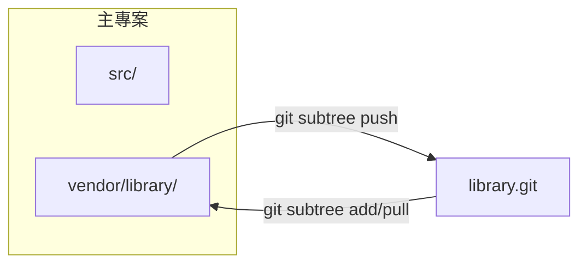

# Git Subtree 完整指南

**在專案中嵌入外部倉庫，無需獨立指標檔案**

Git subtree 允許你將另一個倉庫合併到專案的子目錄中，同時保留從上游拉取更新以及（可選地）推送變更的能力。與 `git submodule` 不同，它不需要 `.gitmodules` 檔案——外部程式碼直接存在於你自己的提交歷史中。

---

## 核心概念

### Subtree 的運作原理



從本質上講，`git subtree` 會將外部倉庫的提交歷史透過 **squash merge** 合併到指定的前綴目錄中。外部提交可以逐條重放到你的樹上，也可以壓縮為單個提交以保持日誌整潔。

### Subtree 與 Submodule 對比

| 維度 | Submodule | Subtree |
| :--- | :--- | :--- |
| **儲存方式** | 主倉庫中僅儲存指標 | 外部歷史完全合併到主倉庫 |
| **工作流程複雜度** | 較高（`init`、`update`、detached HEAD） | 較低（普通 git 操作即可） |
| **獨立歷史** | 是——獨立倉庫 | 否——歷史被合併 |
| **CI/CD 友善度** | 需要 `--recurse-submodules` | 與普通目錄無異 |
| **推送到上游** | 簡單（獨立遠端倉庫） | 可透過 `git subtree push`，但較慢 |
| **克隆體積** | 較小 | 較大（攜帶完整歷史） |
| **學習曲線** | 較陡 | 較平緩 |

:::tip[何時優先使用 Subtree]
- 程式碼與專案 **緊耦合**，不太可能獨立分叉。
- 希望貢獻者 **零額外設定**（無需 `submodule init`）。
- 嵌入的是 **中小型** 外部函式庫，歷史容量可以接受。
:::

---

## 基礎操作

### 新增 Subtree

```bash
# 通用語法
git subtree add --prefix=<路徑> <倉庫URL> <分支> [--squash]

# 範例：將工具函式庫嵌入到 vendor/tools
git subtree add --prefix=vendor/tools https://github.com/example/tools.git main --squash
```

| 參數 | 作用 |
| :--- | :--- |
| `--prefix` | 工作樹中的目標目錄（不存在時會自動建立） |
| `--squash` | 將外部歷史壓縮為單個合併提交（建議，保持日誌整潔） |
| `<分支>` | 要匯入的遠端分支（`main`、`master`、`develop` 等） |

### 拉取上游更新

```bash
# 將遠端最新變更拉取到指定前綴目錄
git subtree pull --prefix=vendor/tools https://github.com/example/tools.git main --squash
```

:::info
`git subtree pull` 內部執行的是 `git merge`。如有衝突，按照標準 Git 衝突解決流程處理即可。
:::

### 推送變更到上游

```bash
# 將本地修改推送到遠端倉庫
git subtree push --prefix=vendor/tools https://github.com/example/tools.git main
```

:::caution
`git subtree push` 需要拆分整個倉庫的歷史，在大型倉庫上會 **很慢**。如果需要頻繁推送，建議直接在遠端倉庫中開發，再透過 `pull` 拉取。
:::

### 拆分 Subtree 歷史

```bash
# 建立一個只包含前綴目錄歷史的分支
git subtree split --prefix=vendor/tools --branch tools-split
```

適用於需要單獨審查或 cherry-pick 屬於 subtree 的提交時。

### 無 merge 的 squash 拉取

如果之前新增時沒有使用 `--squash`，後續 pull 時加上 `--squash` 可以只 squash **本次新增** 的提交：

```bash
git subtree pull --prefix=vendor/tools https://github.com/example/tools.git main --squash
```

---

## 開發工作流程

### 場景：匯入函式庫並做本地修改

```bash
# 1. 新增 subtree（一次性設定）
git subtree add --prefix=vendor/log https://github.com/user/log.git main --squash

# 2. 在本地使用並修改函式庫
# ... 編輯 vendor/log/ ...

# 3. 在主倉庫中提交本地修改
git add vendor/log
git commit -m "vendor(log): 修復解析器記憶體洩漏"

# 4. 將變更推送回上游（需有寫入權限）
git subtree push --prefix=vendor/log https://github.com/user/log.git main

# 5. 後續拉取上游修復
git subtree pull --prefix=vendor/log https://github.com/user/log.git main --squash
```

### 場景：嵌入唯讀第三方函式庫

```bash
# 一次性新增，之後不再推送
git subtree add --prefix=vendor/json https://github.com/nlohmann/json.git master --squash

# 定期拉取更新
git subtree pull --prefix=vendor/json https://github.com/nlohmann/json.git master --squash
```

---

## 使用遠端別名

每次輸入完整 URL 很繁瑣，可以給 subtree 的遠端倉庫起個別名：

```bash
# 新增命名遠端
git remote add tools-remote https://github.com/example/tools.git

# 之後用遠端名代替 URL
git subtree add --prefix=vendor/tools tools-remote main --squash
git subtree pull --prefix=vendor/tools tools-remote main --squash
git subtree push --prefix=vendor/tools tools-remote main
```

---

## 常用模式與最佳實踐

### 保持前綴路徑清晰可預測

```
project/
├── src/                  # 專案程式碼
├── vendor/               # 第三方 subtree
│   ├── log/              # git subtree --prefix=vendor/log
│   └── http-client/      # git subtree --prefix=vendor/http-client
└── ...
```

### 一致使用 `--squash`

在同一專案中混用 squash 和非 squash 的 subtree 會導致歷史混亂。選擇一種方式並始終使用。

### 避免深層嵌套

subtree 內再套 subtree 在技術上可行，但會導致不可預測的合併行為。盡量保持扁平結構。

### 提交訊息規範

```bash
git commit -m "vendor(log): 拉取上游 v2.4.1"
git commit -m "vendor(log): 修復格式化 bug"
```

使用 `vendor(<名稱>):` 前綴，方便透過 `git log --oneline -- vendor/log/` 查看 subtree 的變更時間線。

---

## 疑難排解

| 問題 | 解決方案 |
| :--- | :--- |
| **`subtree push` 極慢** | 在新克隆中執行 `git subtree push`，或先 split 再推送。也可直接在遠端倉庫修改後用 `pull` 拉取。 |
| **`subtree pull` 合併衝突** | 正常解決衝突（`git add <file> && git commit`）。前綴目錄中的檔案可能與你自己的修改衝突。 |
| **前綴目錄用錯了** | 如果誤用了 `--prefix=lib/tools` 而非 `vendor/tools`，用正確前綴重新 add，然後刪除舊目錄（`git rm -r lib/tools`）。 |
| **需要移除 subtree** | `git rm -r <prefix> && git commit -m "remove subtree <name>"`。無需清理設定（與 submodule 不同）。 |
| **歷史膨脹** | 如果忘了 `--squash`，可用 `git filter-branch` 或 `git filter-repo` 重寫歷史，但這是破壞性操作，需要團隊協調。 |

---

## 遷移指南

### 從 Submodule 遷移到 Subtree

```bash
# 1. 移除子模組
git submodule deinit vendor/library
git rm vendor/library
rm -rf .git/modules/vendor/library
git commit -m "chore: 移除子模組 vendor/library"

# 2. 新增為 subtree
git subtree add --prefix=vendor/library https://github.com/user/library.git main --squash
```

### 從手動 vendor 目錄遷移到 Subtree

如果你之前手動複製了一個 vendor 目錄（未透過 Git subtree 管理）：

```bash
# 1. 移除舊的 vendor 內容
git rm -r vendor/library
git commit -m "chore: 移除手動 vendor 的 library"

# 2. 重新以 subtree 方式匯入
git subtree add --prefix=vendor/library https://github.com/user/library.git main --squash
```

### 從 Subtree 遷移到 Submodule

```bash
# 1. 移除 subtree 目錄
git rm -r vendor/library
git commit -m "chore: 移除 subtree vendor/library"

# 2. 新增為子模組
git submodule add https://github.com/user/library.git vendor/library
git commit -m "chore: 將 library 新增為子模組"
```

---

## 進階技巧

### 部分目錄匯入

如果你只需要遠端倉庫中的一個子目錄：

```bash
# 只拆分遠端倉庫中 src/ 目錄的歷史，然後新增
git subtree add --prefix=vendor/lib-core https://github.com/large-org/mono.git src --squash
```

:::caution
這依賴 `git subtree` 的拆分邏輯，對於複雜倉庫結構可能不可靠。正式使用前請充分測試。
:::

### 批次更新腳本

```bash
#!/bin/bash
# scripts/update-subtrees.sh

declare -A SUBTREES=(
    ["vendor/log"]="https://github.com/user/log.git main"
    ["vendor/http-client"]="https://github.com/user/http-client.git main"
)

for prefix in "${!SUBTREES[@]}"; do
    read url branch <<< "${SUBTREES[$prefix]}"
    echo "更新 $prefix（來源 $url $branch）..."
    git subtree pull --prefix="$prefix" "$url" "$branch" --squash
done

echo "所有 subtree 已更新。"
```

---

## 參考資料

- [Pro Git -- Git Tools - Subtree Merging](https://git-scm.com/book/en/v2/Git-Tools-Subtree-Merging)
- [git-subtree 文件（內建）](https://git.wiki.kernel.org/index.php/Git-subtree)
- [Atlassian 教學 -- Git Subtree](https://www.atlassian.com/git/tutorials/git-subtree)
