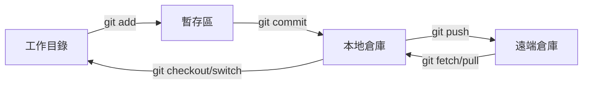
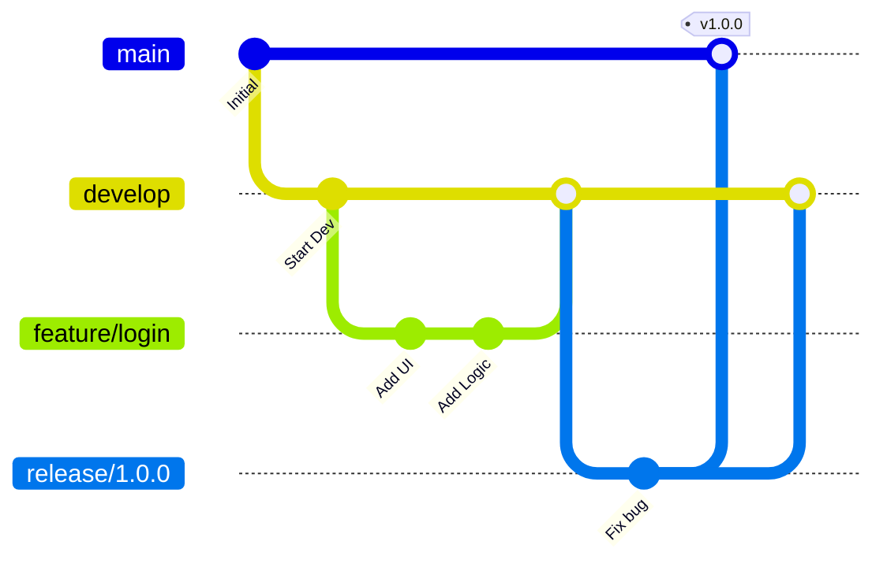
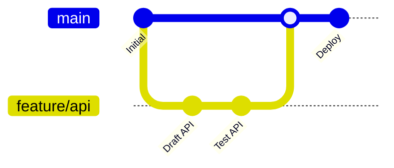

# Git 工作流與分支策略

本指南涵蓋了 Git 工作流、分支策略、Conventional Commits 規範以及日常開發中的常用命令。

## 基礎工作流

標準的 Git 工作流涉及將更改在三個主要區域之間移動：**工作目錄** (Working Directory)、**暫存區** (Staging Area/Index) 和 **倉庫** (Repository/HEAD)。



### 理解 Git 的三個區域

Git 在三個不同的區域管理檔案，每個區域都有特定的用途：

| 區域 | 用途 | 您看到的內容 |
| :--- | :--- | :--- |
| **工作目錄** | 您在磁碟上實際操作檔案的地方，進行編輯 | 最新狀態的檔案（編輯後的內容） |
| **暫存區** (索引) | 準備區域，您在此選擇要包含在下一次提交中的更改 | 將包含在下一次提交中的檔案快照 |
| **倉庫** (HEAD) | 已提交更改的永久歷史記錄 | 包含元資料（作者、日期、訊息）的完整提交歷史 |

**關鍵區別：**

- **工作目錄 vs 暫存區**：工作目錄包含您的最新編輯，而暫存區僅包含您使用 `git add` 明確標記的更改。您可以編輯檔案十次，但只暫存最終版本。

- **暫存區 vs 倉庫**：暫存區保存*下一次*提交的更改（臨時），而倉庫儲存*整個*提交歷史（永久）。只有 `git commit` 才能將更改從暫存區移動到倉庫。

- **HEAD**：指向當前檢出的提交的指標，通常是當前分支上的最新提交。

### 各區域的操作指令

#### 工作目錄

| 指令 | 用途 |
| :--- | :--- |
| `git status` | 查看哪些檔案已被修改 |
| `git diff` | 查看尚未暫存的更改 |
| `git checkout -- <file>` | 丟棄工作目錄中的更改（恢復到最後提交的版本） |
| `git restore <file>` | `git checkout -- <file>` 的現代替代指令 |

#### 暫存區

| 指令 | 用途 |
| :--- | :--- |
| `git add <file>` | 暫存特定檔案 |
| `git add .` | 暫存所有已修改檔案 |
| `git add -p` | 互動式暫存（逐塊選擇） |
| `git restore --staged <file>` | 取消暫存檔案（保留更改） |
| `git diff --staged` | 查看準備提交的更改 |
| `git reset` | 取消暫存所有檔案 |

#### 倉庫

| 指令 | 用途 |
| :--- | :--- |
| `git commit -m "message"` | 提交暫存的更改 |
| `git commit -am "message"` | 提交所有已跟蹤檔案（跳過暫存） |
| `git log --oneline` | 查看提交歷史 |
| `git show <hash>` | 查看特定提交的詳細資訊 |
| `git reset --soft HEAD~1` | 撤銷最後一次提交，保留更改在暫存區 |
| `git reset --hard HEAD~1` | 撤銷最後一次提交，丟棄所有更改 |

### 常見陷阱與安全規則

了解這些風險有助於防止資料遺失和倉庫損壞。

:::danger[關鍵規則]
1. **盡量不要強制推送到共享分支**（`main`、`develop`）- 如必須強制推送，使用 `--force-with-lease` 並先協調/確認
2. **避免改寫共享分支上已發布的歷史** - 在常規工作流中，已推送的提交應視為不可變
3. **執行破壞性操作前先檢查** - 運行 `git status` 和 `git diff`
4. **使用 `git reflog` 恢復** - 可恢復遺失的提交
:::

| 區域 | 風險 | 預防措施 |
| :--- | :--- | :--- |
| **工作目錄** | 使用 `git checkout -- <file>` 丟棄未提交的工作 | 丟棄前檢查 `git diff` |
| **暫存區** | 使用 `git add .` 意外暫存過多內容 | 使用 `git add -p` 互動式暫存 |
| **倉庫** | `git reset --hard` 永久丟棄提交 | 建立備份分支：`git branch backup` |

:::tip[安全工作流程]
- 對共享歷史使用 `git revert` 而非 `git reset`
- 使用 `git reset --soft` 撤銷提交而不遺失更改
- 切換分支前先提交或 stash
:::

---

## 分支策略

選擇合適的分支策略取決於團隊規模和發佈頻率。

### Git Flow
**最適用於：** 定期發佈和版本化產品。



*   **main**: 僅限生產就緒代碼。
*   **develop**: 功能集成分支。
*   **feature/**: 新功能臨時分支。
*   **release/**: 新生產版本準備分支。
*   **hotfix/**: 生產環境 Bug 緊急修復。

### GitHub Flow
**最適用於：** 持續部署 (CD) 和 Web 應用程式。



*   `main` 分支始終保持可部署狀態。
*   從 `main` 建立短週期的功能分支。
*   CI/CD 通過後，通過 Pull Request 合併回 `main`。

---

## 約定式提交 (Conventional Commits)

標準化提交訊息使歷史記錄清晰可讀，並能實現自動生成變更日誌 (Changelog)。

**格式：** `<type>(<scope>): <subject>`

| 類型 | 用途 | 範例 |
| :--- | :--- | :--- |
| `feat` | 新功能 | `feat(auth): add JWT support` |
| `fix` | Bug 修復 | `fix(api): handle null response` |
| `docs` | 僅文件更新 | `docs: update readme` |
| `refactor` | 代碼重構（不修復 Bug 也不增加功能） | `refactor: simplify loop` |
| `chore` | 維護（構建、依賴、工具） | `chore: update docusaurus` |

:::tip[原子性]
保持提交的**原子性**。一個提交應代表一個邏輯變更。這使 `git revert` 和 `git cherry-pick` 更加安全。
:::

---

## 常用指令

### 歷史與檢查

| 指令 | 用途 |
| :--- | :--- |
| `git status -s` | 簡短狀態摘要 |
| `git diff --staged` | 查看已加入暫存區的更改 |
| `git log --oneline --graph --all` | 所有分支的可視化展示 |
| `git blame <file>` | 識別每一行的修改者 |

### 撤銷與恢復

| 指令 | 效果 | 場景 |
| :--- | :--- | :--- |
| `git commit --amend` | 修改最後一個提交 | 遺漏檔案或提交訊息拼寫錯誤 |
| `git reset --soft HEAD~1` | 撤銷提交，保留更改在暫存區 | 重新正確提交 |
| `git reset --hard HEAD~1` | **破壞性**：回退到上一狀態 | 丟棄不需要的工作 |
| `git revert <hash>` | 建立一個撤銷之前提交的新提交 | 安全地撤銷已推送的提交 |

:::warning[強制推送]
切勿在 `main` 或 `develop` 等共享分支上使用 `git push --force`。如果必須在變基後更新遠端分支，請使用 `git push --force-with-lease`。
:::

---

## 高級工具

### Git Stash
臨時保存未提交的更改以切換分支。
*   `git stash`: 保存工作
*   `git stash pop`: 恢復工作

### Git Worktree

管理**多個工作目錄**，它們都指向同一個倉庫，讓你可以同時檢出不同分支而無需 stash 或切換。

#### 為何使用 Worktree？

| 沒有 Worktree 的痛點 | 使用 Worktree 的解決方案 |
| :--- | :--- |
| 切換分支前需要 `git stash` | 每個分支一個目錄，無需 stash |
| 長時間構建阻塞分支切換 | 在一個工作樹中構建，在另一個中編輯程式碼 |
| 對比分支需要 `git diff` | 在兩個目錄中開啟編輯器直接對比 |

#### 核心指令

| 指令 | 用途 |
| :--- | :--- |
| `git worktree add <路徑> <分支>` | 在 `<路徑>` 建立新的工作樹並檢出 `<分支>` |
| `git worktree add -b <新分支> <路徑> <起點>` | 同時建立新分支和工作樹 |
| `git worktree list` | 列出所有關聯的工作樹 |
| `git worktree remove <路徑>` | 移除工作樹（不會刪除分支） |
| `git worktree prune` | 清理過期的工作樹條目（如手動刪除目錄後） |

#### 範例工作流程

```bash
# 你正在 main 上開發新功能
# 突然需要對生產分支 v2.0 做 hotfix

# 1. 為 hotfix 建立工作樹（無需 stash 任何東西）
git worktree add ../hotfix-dir v2.0

# 2. 在獨立目錄中修復 Bug
cd ../hotfix-dir
# ... 編輯、提交、推送 ...
git push origin v2.0

# 3. 回到原來的工作
cd ../project
# 功能分支仍在原來的位置，一切未變

# 4. 清理 hotfix 工作樹
git worktree remove ../hotfix-dir
```

:::tip[命名規範]
為工作目錄使用統一的前綴，如 `../project-hotfix`、`../project-review`、`../project-release`，保持工作區整潔。
:::

:::caution
同一分支**同時只能在一個工作樹中**檢出。嘗試在兩個工作樹中檢出相同分支會失敗。
:::

### Git Bisect
通過二分查找確定引入 Bug 的提交。
*   `git bisect start`
*   `git bisect bad`
*   `git bisect good <stable-hash>`

---

## 相關指南

*   [📄 Merge、Rebase 與 Cherry-Pick](./git-merge-rebase-cherry-pick.mdx) — 分支集成與歷史改寫。
*   [📄 Git Hooks 指南](./git-hooks-guide.mdx) — 自動化代碼檢查和測試。
*   [📄 子模組 (Submodules) 指南](./git-composition-strategy/submodule.mdx) — 管理外部依賴。
*   [📄 SSH 設置](../infra/06-ssh.mdx) — 安全遠端訪問。
