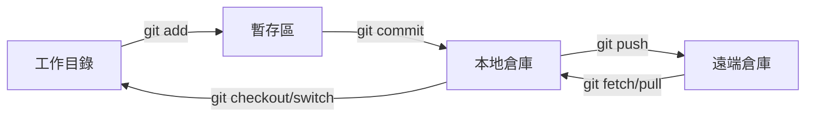
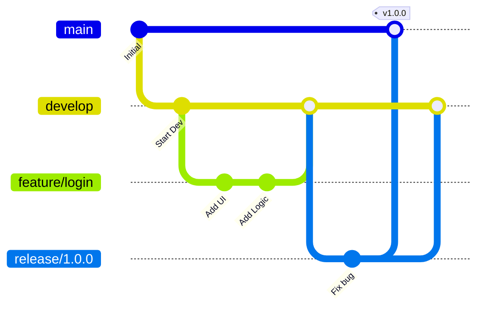
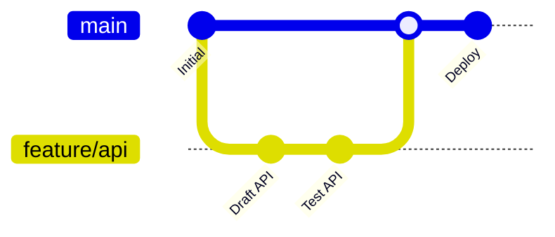

# Git 工作流與分支策略

本指南涵蓋了 Git 工作流、分支策略、Conventional Commits 規範以及日常開發中的常用命令。

## 基礎工作流

標準的 Git 工作流涉及將更改在三個主要區域之間移動：**工作目錄** (Working Directory)、**暫存區** (Staging Area/Index) 和 **倉庫** (Repository/HEAD)。

---

## 分支策略

選擇合適的分支策略取決於團隊規模和發佈頻率。

### 1. Git Flow
**最適用於：** 定期發佈和版本化產品。

*   **main**: 僅限生產就緒代碼。
*   **develop**: 功能集成分支。
*   **feature/**: 新功能臨時分支。
*   **release/**: 新生產版本準備分支。
*   **hotfix/**: 生產環境 Bug 緊急修復。

### 2. GitHub Flow
**最適用於：** 持續部署 (CD) 和 Web 應用程式。

*   `main` 分支始終保持可部署狀態。
*   從 `main` 建立短週期的功能分支。
*   CI/CD 通過後，通過 Pull Request 合併回 `main`。

---

## 約定式提交 (Conventional Commits)

標準化提交訊息使歷史記錄清晰可讀，並能實現自動生成變更日誌 (Changelog)。

**格式：** `<type>(<scope>): <subject>`

| 類型 | 用途 | 範例 |
| :--- | :--- | :--- |
| `feat` | 新功能 | `feat(auth): add JWT support` |
| `fix` | Bug 修復 | `fix(api): handle null response` |
| `docs` | 僅文件更新 | `docs: update readme` |
| `refactor` | 代碼重構（不修復 Bug 也不增加功能） | `refactor: simplify loop` |
| `chore` | 維護（構建、依賴、工具） | `chore: update docusaurus` |

:::tip 原子性
保持提交的**原子性**。一個提交應代表一個邏輯變更。這使 `git revert` 和 `git cherry-pick` 更加安全。
:::

---

## 常用指令

### 歷史與檢查

| 指令 | 用途 |
| :--- | :--- |
| `git status -s` | 簡短狀態摘要 |
| `git diff --staged` | 查看已加入暫存區的更改 |
| `git log --oneline --graph --all` | 所有分支的可視化展示 |
| `git blame <file>` | 識別每一行的修改者 |

### 撤銷與恢復

| 指令 | 效果 | 場景 |
| :--- | :--- | :--- |
| `git commit --amend` | 修改最後一個提交 | 遺漏檔案或提交訊息拼寫錯誤 |
| `git reset --soft HEAD~1` | 撤銷提交，保留更改在暫存區 | 重新正確提交 |
| `git reset --hard HEAD~1` | **破壞性**：回退到上一狀態 | 丟棄不需要的工作 |
| `git revert <hash>` | 建立一個撤銷之前提交的新提交 | 安全地撤銷已推送的提交 |

:::warning 強制推送
切勿在 `main` 或 `develop` 等共享分支上使用 `git push --force`。如果必須在變基後更新遠端分支，請使用 `git push --force-with-lease`。
:::

---

## 高級工具

### Git Stash
臨時保存未提交的更改以切換分支。
*   `git stash`: 保存工作
*   `git stash pop`: 恢復工作

### Git Worktree
在不同目錄中同時處理同一倉庫的多個分支。
*   `git worktree add ../fix-branch branch-name`

### Git Bisect
通過二分查找確定引入 Bug 的提交。
*   `git bisect start`
*   `git bisect bad`
*   `git bisect good <stable-hash>`

---

## 相關指南

*   [📄 Merge、Rebase 與 Cherry-Pick](./git-merge-rebase-cherry-pick.mdx) — 分支集成與歷史改寫。
*   [📄 Git Hooks 指南](./git-hooks-guide.mdx) — 自動化代碼檢查和測試。
*   [📄 子模組 (Submodules) 指南](./git-submodule-guide.mdx) — 管理外部依賴。
*   [📄 SSH 設置](../infra/06-ssh.mdx) — 安全遠端訪問。
