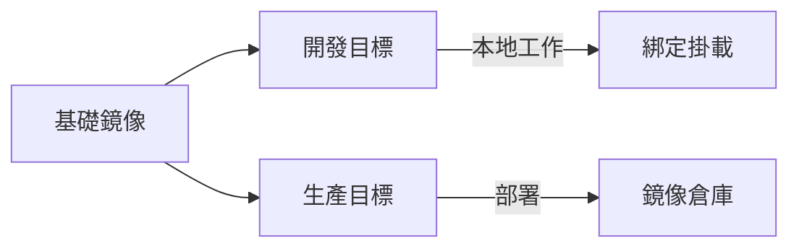

# 基礎設施搭建 (Docker Compose)

本指南定義了使用 **Docker Compose** 進行本地基礎設施編排的標準方法。我們優先採用 **分層、基於 Profile 的配置**，可從簡單服務擴展到複雜的多平台架構。

## 🏗 Docker Compose 架構

使用 **分層 Compose 文件** 方法：基礎文件定義核心基礎設施，疊加文件（Overlay files）添加特定環境或特定 Profile 的配置。

### 目錄結構

```text
infra/ (或 platform-dev/)
├── compose.yaml              # 基礎：基礎設施服務 (Postgres, Redis 等)
├── compose.dev.yaml          # 開發疊加：綁定掛載、調試端口、熱重載
├── compose.staging.yaml      # 預發佈疊加：生產目標、預發佈配置
├── compose.prod.yaml         # 生產疊加：不可變鏡像、資源限制
└── env/
    ├── compose.dev.env       # Compose 插值變量 (開發)
    ├── compose.staging.env   # Compose 插值變量 (預發佈)
    ├── compose.prod.env      # Compose 插值變量 (生產)
    ├── shared.base.env       # 跨服務運行時變量 (所有環境)
    ├── shared.dev.env        # 跨服務運行時變量 (開發覆蓋)
    ├── shared.prod.env       # 跨服務運行時變量 (生產值)
    ├── service-a.dev.env     # 特定服務變量 (開發)
    └── service-a.prod.env    # 特定服務變量 (生產)
```

:::tip 專業提示：文件命名
始終使用 `.yaml`（而非 `.yml`）以及 `compose.yaml`（現代標準），以保持跨項目的一致性。
:::

### 執行策略

```bash
# 後面的文件會覆蓋前面的配置
docker compose \
  --env-file ./env/compose.dev.env \
  -f compose.yaml \
  -f compose.dev.yaml \
  --profile dev \
  up -d
```

---

## 📦 基礎基礎設施服務

基礎 `compose.yaml` 文件定義了所有服務都依賴的共享基礎設施。

### `compose.yaml` (節錄)

```yaml
services:
  database:
    image: postgres:16-alpine
    environment:
      POSTGRES_USER: devuser
      POSTGRES_PASSWORD: devpass
      POSTGRES_DB: platform_db
    ports:
      - "5432:5432"
    volumes:
      - db_data:/var/lib/postgresql/data
    healthcheck:
      test: ["CMD-SHELL", "pg_isready -U devuser -d platform_db"]
      interval: 5s
      timeout: 3s
      retries: 10

  message-queue:
    image: rabbitmq:3-management-alpine
    environment:
      RABBITMQ_DEFAULT_USER: guest
      RABBITMQ_DEFAULT_PASS: guest
    ports:
      - "5672:5672"
      - "15672:15672"
    volumes:
      - mq_data:/var/lib/rabbitmq
    healthcheck:
      test: ["CMD", "rabbitmq-diagnostics", "ping"]
      interval: 5s
      timeout: 3s
      retries: 10
```

:::info 關鍵設計決策
- **健康檢查 (Health Checks)**：始終包含健康檢查，以便依賴服務可以使用 `condition: service_healthy` 來避免啟動競爭條件。
- **命名卷 (Named Volumes)**：使用命名卷在容器生命週期內保持數據持久化。
- **Alpine 鏡像**：優先使用基於 Alpine 的鏡像，以獲得更小的佔用空間和更快的 CI/CD 拉取速度。
:::

---

## 🛠 開發覆蓋 (Overrides)

開發疊加文件 (`compose.dev.yaml`) 添加了本地源代碼的綁定掛載、調試端口以及特定於應用程序的服务。

### 開發模式

```yaml
services:
  api:
    build:
      context: ../api-gateway
      dockerfile: Dockerfile
      target: dev                         # 多階段：使用 dev 目標
    command: npm run dev
    ports:
      - "3000:3000"
    volumes:
      - ../api-gateway:/workspace/api-gateway
      - /workspace/api-gateway/node_modules   # 防止宿主機覆蓋 node_modules
    depends_on:
      database: { condition: service_healthy }
    env_file:
      - ./env/shared.base.env
      - ./env/shared.dev.env
    profiles:
      - dev
```

:::caution Monorepo 上下文
在 Monorepo 中，`build.context` 通常應該是倉庫根目錄 (`..`) 以允許複製共享庫，而 `dockerfile` 指向具體的應用目錄。
:::

---

## 🔐 環境變量策略

我們遵循 **分層覆蓋** 模式：基礎契約 → 環境覆蓋 → 機密信息。

| 層級 | 用途 | 來源 |
| :--- | :--- | :--- |
| **Compose 插值** | 控制鏡像標籤、項目名稱 | `--env-file` 標誌 |
| **共享基礎** | 服務發現、隊列名稱 | `env_file` (shared.base.env) |
| **環境覆蓋** | 日誌級別、TTL | `env_file` (shared.dev.env) |
| **機密信息** | 密碼、金鑰 | **Vault / 外部管理器** |

:::danger 安全警示
**絕不** 將實際的生產機密信息提交到版本控制。使用 `.env.example` 文件作為模板，並在運行時使用安全的機密管理器注入機密。
:::

---

## 🌐 網絡與服務發現

同一 Compose 項目中的所有服務共享一個默認的橋接網絡，並可以通過 **服務名稱** 相互解析。

### 連接示例

| 上下文 | 協議 | 地址 |
| :--- | :--- | :--- |
| **容器間** | Docker DNS | `http://database:5432` |
| **宿主機到容器** | 端口映射 | `http://localhost:5432` |
| **跨服務** | 共享網絡 | `http://ai-service:8001/api/infer` |

---

## 📑 多階段 Dockerfile 模式

每個服務 **必須** 使用多階段構建，以將開發工具與生產運行時分離。



### 模式對比

| 維度 | 開發目標 (Dev Target) | 生產目標 (Prod Target) |
| :--- | :--- | :--- |
| **調試工具** | 包含 (Nodemon, Inspect) | 排除 |
| **依賴項** | 完整 (開發 + 運行時) | 僅運行時 |
| **源代碼** | 綁定掛載 | 複製並構建 |
| **安全性** | 非 Root (映射 UID) | 最小化 (nobody/alpine) |

---

*上一篇: [架構概覽](./architecture-overview)*
*下一篇: [開發環境](./development-environment)*
