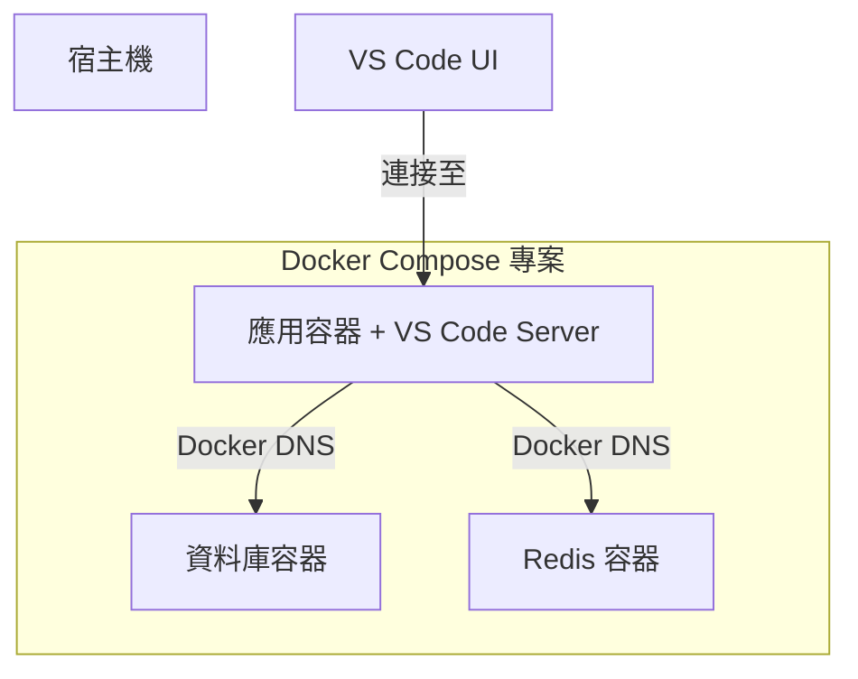

# 開發環境 (Dev Containers)

我們使用 **VS Code Dev Containers** 為每位工程師提供一致、隔離且可重用的開發環境。這種方法消除了「在我的機器上可以執行」的問題，並將入職配置時間從幾天縮短到幾分鐘。

## 🌟 什麼是 Dev Container？

**Dev Container** 是由 `devcontainer.json` 文件定義的標準化環境。它允許你將 Docker 容器用作功能齊全的開發環境。

### 開發體驗

1.  **複製** (Clone) 代碼庫。
2.  在 VS Code 中**開啟**。
3.  根據提示選擇 **在容器中重新開啟** (Reopen in Container)。
4.  **等待**環境構建完成。
5.  **開始編碼**，所有運行時、工具和擴充插件均已預先配置。

:::info 底層原理
VS Code 的 UI 運行在宿主機上，而 **VS Code Server**、終端機、偵錯器以及所有運行時（Node, Python, Go）都運行在容器**內部**。
:::

---

## ⚖️ Dev Container vs. 本地開發

| 特性 | 本地開發 | Dev Container |
| :--- | :--- | :--- |
| **一致性** | 不同機器間存在差異 | **所有人完全一致** |
| **入職配置** | 20 步安裝指南 | **一鍵完成** |
| **隔離性** | 污染宿主機環境 | **完全隔離** |
| **版本管理** | 版本衝突 (如 Node 18 vs 20) | **專案特定** |
| **啟動速度** | 即時 | 10-30 秒額外開銷 |

---

## 🛠 使用 Docker Compose 進行編排

對於複雜的應用程式，我們將 **Dev Containers** 與 **Docker Compose** 結合使用，以同時管理應用程式及其依賴項（資料庫、Redis 等）。



---

## 📝 配置 (devcontainer.json)

我們服務的典型配置如下：

```json
{
  "name": "Platform Service",
  "dockerComposeFile": [
    "../../infra/compose.yaml",
    "../../infra/compose.dev.yaml"
  ],
  "service": "api",
  "workspaceFolder": "/workspace/api",
  "remoteUser": "vscode",
  "customizations": {
    "vscode": {
      "extensions": [
        "ms-python.python",
        "dbaeumer.vscode-eslint",
        "eamodio.gitlens"
      ],
      "settings": {
        "editor.formatOnSave": true
      }
    }
  },
  "features": {
    "ghcr.io/devcontainers/features/git:1": {}
  },
  "postCreateCommand": "npm install && npm run db:migrate"
}
```

:::tip 專業提示：Features
使用 **Dev Container Features** 可以快速添加 AWS CLI、Terraform 或特定的 Git 輔助工具，而無需修改 Dockerfile。
:::

---

## 🔐 SSH Agent 轉發

為了確保私鑰安全，我們使用 **SSH Agent 轉發**。你的私鑰永遠不會進入容器；容器只需「請求」宿主機對 Git 或 SSH 操作進行簽名。

### 宿主機準備

#### macOS/Linux
```bash
# 將私鑰添加到 agent
ssh-add ~/.ssh/id_ed25519
```

#### Windows (WSL2)
確保 SSH agent 在 WSL2 環境中運行並已添加私鑰。

### 容器內驗證
```bash
# 在容器終端機內執行
echo $SSH_AUTH_SOCK
# 應輸出: /run/host-services/ssh-auth.sock

ssh-add -l
# 應列出宿主機的私鑰
```

---

## 🚀 日常工作流

### 1. 開始工作
```bash
# 在宿主機上：啟動基礎設施
docker compose --profile dev up -d
```

### 2. 編寫代碼
- 打開 VS Code。
- 在容器中重新打開。
- 編輯代碼（透過掛載卷實現熱重載）。

### 3. 提交更改
Git 操作可以在容器的整合終端機中自然運行。
```bash
git add .
git commit -m "feat: add new endpoint"
git push origin main
```

---

## ❓ 常見問題排查

### "fatal: detected dubious ownership"
**原因**：宿主機與容器之間的文件權限不匹配。
**解決**：在容器內運行 `git config --global --add safe.directory '*'`，或確保 `devcontainer.json` 中 `updateRemoteUserUID` 設置為 `true`。

### SSH 身份驗證失敗
**原因**：宿主機上未運行 SSH agent 或未添加私钥。
**解決**：在宿主機上運行 `ssh-add -l` 檢查私鑰是否已加載。

---

*上一篇: [基礎設施設置](./infrastructure-setup)*
*下一篇: [生產環境部署](./production-deployment)*
