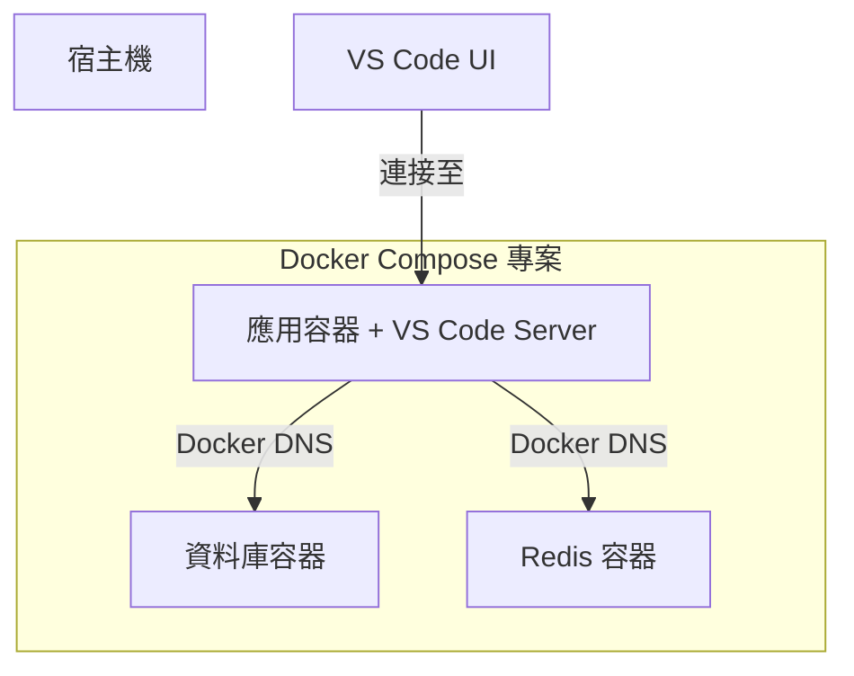

# Dev Containers

我們使用 **VS Code Dev Containers** 為每位工程師提供一致、隔離且可重用的開發環境。這種方法消除了「在我的機器上可以執行」的問題，並將入職配置時間從幾天縮短到幾分鐘。

## 🌟 什麼是 Dev Container？

**Dev Container** 是由 `devcontainer.json` 文件定義的標準化環境。它允許你將 Docker 容器用作功能齊全的開發環境。

### 開發體驗

1.  **複製** (Clone) 代碼庫。
2.  在 VS Code 中**開啟**。
3.  根據提示選擇 **在容器中重新開啟** (Reopen in Container)。
4.  **等待**環境構建完成。
5.  **開始編碼**，所有運行時、工具和擴充插件均已預先配置。

:::info[底層原理]
VS Code 的 UI 運行在宿主機上，而 **VS Code Server**、終端機、偵錯器以及所有運行時（Node, Python, Go）都運行在容器**內部**。
:::

---

## ⚖️ Dev Container vs. 本地開發

| 特性 | 本地開發 | Dev Container |
| :--- | :--- | :--- |
| **一致性** | 不同機器間存在差異 | **所有人完全一致** |
| **入職配置** | 20 步安裝指南 | **一鍵完成** |
| **隔離性** | 污染宿主機環境 | **完全隔離** |
| **版本管理** | 版本衝突 (如 Node 18 vs 20) | **專案特定** |
| **啟動速度** | 即時 | 10-30 秒額外開銷 |

---

## 🛠 使用 Docker Compose 進行編排

對於複雜的應用程式，我們將 **Dev Containers** 與 **Docker Compose** 結合使用，以同時管理應用程式及其依賴項（資料庫、Redis 等）。



---

## 📝 配置 (devcontainer.json)

我們服務的典型配置如下：

```json
{
  "name": "Platform Service",
  "dockerComposeFile": [
    "../../infra/compose.yaml",
    "../../infra/compose.dev.yaml"
  ],
  "service": "api",
  "workspaceFolder": "/workspace/api",
  "remoteUser": "vscode",
  "customizations": {
    "vscode": {
      "extensions": [
        "ms-python.python",
        "dbaeumer.vscode-eslint",
        "eamodio.gitlens"
      ],
      "settings": {
        "editor.formatOnSave": true
      }
    }
  },
  "features": {
    "ghcr.io/devcontainers/features/git:1": {}
  },
  "postCreateCommand": "npm install && npm run db:migrate"
}
```

### Monorepo vs Polyrepo：Compose 文件路徑

`devcontainer.json` 中 `dockerComposeFile` 的路徑因倉庫策略而異：

| 策略 | `dockerComposeFile` 示例 | 說明 |
| :--- | :--- | :--- |
| **Polyrepo** | `"../../infra/compose.yaml"` | `infra/` 在兄弟倉庫或共享目錄中。 |
| **Monorepo** | `"../../compose.yaml"` | Compose 文件在倉庫根目錄；`devcontainer.json` 在各服務的 `services/` 下。 |

```json title="Monorepo devcontainer.json"
{
  "name": "API Gateway",
  "dockerComposeFile": [
    "../../compose.yaml",
    "../../compose.dev.yaml"
  ],
  "service": "api-gateway",
  "workspaceFolder": "/workspace/services/api-gateway"
}
```

:::info[關鍵區別]
在 **Monorepo** 中，`workspaceFolder` 和 `service` 名稱必須匹配服務的子目錄路徑。在 **Polyrepo** 中，`workspaceFolder` 通常映射到倉庫根目錄。
:::

---

## 🔧 Dev Container Features

**Features** 是可安裝的預打包單元，可以在不修改 `Dockerfile` 的情況下向 Dev Container 添加工具、運行時或 CLI 工具。這是擴展開發環境的模組化、宣告式方式。

### 使用方式

在 `devcontainer.json` 的 `"features"` 字段中添加：

```json
{
  "features": {
    "ghcr.io/devcontainers/features/node:1": { "version": "20" },
    "ghcr.io/devcontainers/features/aws-cli:1": {},
    "ghcr.io/devcontainers/features/terraform:1": { "version": "1.7" }
  }
}
```

### Features vs. Dockerfile vs. Compose

| 方式 | 適用場景 | 取捨 |
| :--- | :--- | :--- |
| **Dev Container Features** | 跨專案共享的標準工具（AWS CLI、Git、Terraform）。 | 宣告式、自動更新、無需修改 Dockerfile。僅限目錄中可用的工具。 |
| **Dockerfile `RUN`** | 自訂或專案特定的工具安裝。 | 完全控制，但增加映像檔構建時間和 Dockerfile 複雜度。 |
| **Compose `command`** | 運行時配置、環境設置、服務編排。 | 影響容器生命週期，不影響工具可用性。 |

:::tip[推薦]
優先使用 **Features** 目錄中已有的工具。只有當工具不在目錄中或需要自訂構建步驟時，才回退到 `Dockerfile` 安裝。
:::

---

## 💻 Dev Container CLI

**Dev Container CLI**（`@devcontainers/cli`）是 [Dev Containers 規範](https://containers.dev/) 的參考實現。它允許你透過命令行構建和管理開發容器，無需依賴 VS Code。

### 安裝

```bash
# 全局安裝
npm install -g @devcontainers/cli

# 或直接透過 npx 使用
npx @devcontainers/cli --help
```

### 常用命令

| 命令 | 說明 |
| :--- | :--- |
| `devcontainer up` | 從 `devcontainer.json` 創建並啟動開發容器 |
| `devcontainer exec <cmd>` | 在運行中的開發容器內執行命令 |
| `devcontainer build` | 構建開發容器映像檔（用於發布） |
| `devcontainer read-configuration` | 讀取並解析完整的 `devcontainer.json` 配置 |

### 典型場景

**無需 VS Code 即可在開發容器中運行命令：**

```bash
devcontainer up --workspace-folder .
devcontainer exec --workspace-folder . npm test
```

**在 CI/CD 中預構建並發布開發容器映像檔：**

```bash
devcontainer build --workspace-folder . --push true --image-name ghcr.io/my-org/devcontainer:latest
```

在 CI 流水線中預構建映像檔並推送到容器註冊表，可以顯著加快容器啟動速度。

:::tip[何時使用 CLI]
當你需要**在 VS Code 之外**與開發容器互動時使用 CLI —— 例如 CI/CD 流水線、無頭伺服器或非 VS Code 編輯器。日常開發中，VS Code Dev Containers 擴充提供最無縫的體驗。
:::

---

## 🔐 SSH Agent 轉發

為了確保私鑰安全，我們使用 **SSH Agent 轉發**。你的私鑰永遠不會進入容器；容器只需「請求」宿主機對 Git 或 SSH 操作進行簽名。

### 宿主機準備

#### macOS/Linux
```bash
# 將私鑰添加到 agent
ssh-add ~/.ssh/id_ed25519
```

#### Windows (WSL2)
確保 SSH agent 在 WSL2 環境中運行並已添加私鑰。

### 容器內驗證
```bash
# 在容器終端機內執行
echo $SSH_AUTH_SOCK
# 應輸出: /run/host-services/ssh-auth.sock

ssh-add -l
# 應列出宿主機的私鑰
```

---

## 🚀 日常工作流

### 開始工作
```bash
# 在宿主機上：啟動基礎設施
docker compose --profile dev up -d
```

### 編寫代碼
- 打開 VS Code。
- 在容器中重新打開。
- 編輯代碼（透過掛載卷實現熱重載）。

### 提交更改
Git 操作可以在容器的整合終端機中自然運行。
```bash
git add .
git commit -m "feat: add new endpoint"
git push origin main
```

---

## ❓ 常見問題排查

### "fatal: detected dubious ownership"
**原因**：宿主機與容器之間的文件權限不匹配。
**解決**：在容器內運行 `git config --global --add safe.directory '*'`，或確保 `devcontainer.json` 中 `updateRemoteUserUID` 設置為 `true`。

### SSH 身份驗證失敗
**原因**：宿主機上未運行 SSH agent 或未添加私钥。
**解決**：在宿主機上運行 `ssh-add -l` 檢查私鑰是否已加載。
