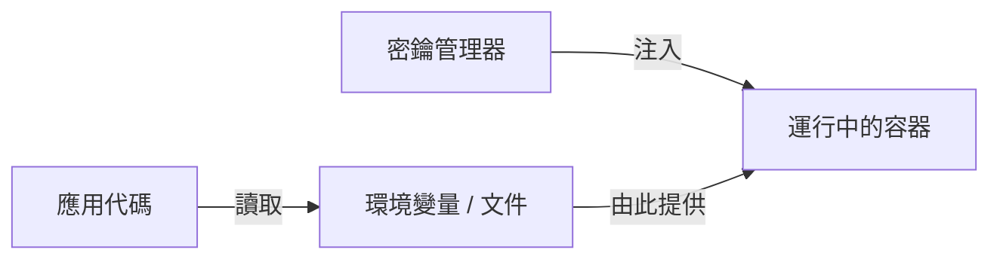
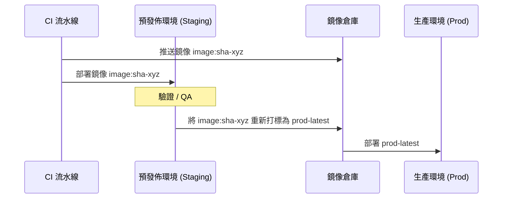

# 生產部署 (CI/CD)

我們的部署策略側重於 **環境一致性**、**不可變鏡像** 和 **自動化流水線**。我們確保在推送到生產環境之前，在預發佈 (Staging) 環境中驗證完全相同的構建產物。

## 🏗 環境分層

| 層級 | 用途 | 構建目標 | 配置來源 |
| :--- | :--- | :--- | :--- |
| **開發環境 (Dev)** | 本地迭代 | `dev` | `.dev.env` (插值) |
| **預發佈環境 (Staging)** | 生產前驗證 | **`prod`** | `.staging.env` + CI 密鑰 |
| **生產環境 (Prod)** | 面向客戶 | **`prod`** | **外部密鑰管理器** |

:::info 部署原則
**一次構建，多次部署**：我們僅構建一次 Docker 鏡像（使用 `prod` 目標），並通過僅更改配置（環境變量）將其推廣到各個環境。
:::

---

## 🏷 鏡像構建與標籤

我們使用 **Git SHAs** 進行確定性打標，確保每個部署的鏡像都能追溯到特定的提交。

```bash
GIT_SHA=$(git rev-parse --short HEAD)
# 標籤示例: registry.company.com/service-name:sha-a1b2c3d
```

### 使用 Docker Buildx Bake 進行批量構建
對於多服務平台，我們使用 `docker-bake.hcl` 來並行化構建並管理複雜的依賴關係。

```hcl
group "default" {
  targets = ["api", "worker", "frontend"]
}

target "api" {
  context = "../api"
  dockerfile = "Dockerfile"
  target = "prod"
  tags = ["${REGISTRY}/api:sha-${GIT_SHA}", "${REGISTRY}/api:latest"]
}
```

---

## 🔐 密鑰管理

**生產環境密鑰絕不能存儲在版本控制或 `.env` 文件中。**



### 安全檢查清單
- [ ] **Git 中無密鑰**：使用 `.env.example` 作為模板。
- [ ] **運行時注入**：在容器編排層面注入密鑰（K8s Secrets, Docker Secrets 或 Vault）。
- [ ] **最小權限**：僅注入特定服務實際需要的密鑰。

---

## 🔄 數據庫遷移

遷移與應用程序啟動解耦，以防止競態條件並確保回退安全。

1.  **運行遷移**：運行一個針對數據庫的短壽命「遷移」容器。
2.  **驗證成功**：部署流水線等待遷移完成。
3.  **部署應用**：僅在遷移成功後才滾動更新應用程序容器。

:::caution 向後兼容性
務必確保數據庫遷移是**向後兼容**的，這樣當前運行的（舊版本）應用在遷移過程中不會崩潰。
:::

---

## 🚀 推廣工作流

在經過手動或自動化驗證後，我們將鏡像從預發佈環境推廣到生產環境。



