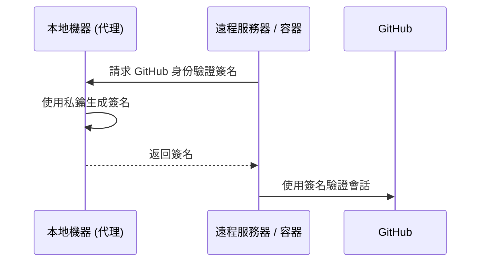

# SSH 與訪問安全

對遠程服務器和 Git 倉庫的安全訪問從根本上建立在 **SSH (Secure Shell)** 協議之上。我們利用非對稱加密技術，確保身份驗證憑據永遠不會在網絡上傳輸，並僅存儲在您的本地計算機上。

## 1. SSH 加密基礎

SSH 身份驗證依賴於由兩個數學相關文件組成的 **公私鑰對**。

| 組件 | 默認路徑 | 用途 |
| :--- | :--- | :--- |
| **私鑰** | `~/.ssh/id_ed25519` | **受限訪問。** 僅存儲在您的本地計算機上。 |
| **公鑰** | `~/.ssh/id_ed25519.pub` | **公開分發。** 分發到服務器和 GitHub。 |

:::tip 算法建議
我們為所有新密鑰對統一採用 **Ed25519** 算法。與舊的 RSA 標準相比，它具有更優越的性能和更高的安全性。
:::

---

## 2. 基礎設施設置指南

### 2.1 生成密鑰對
執行以下命令生成新的密鑰對：
```bash
ssh-keygen -t ed25519 -C "your_email@example.com"
```
:::note
接受默認存儲路徑並為本地加密提供強密碼。
:::

### 2.2 使用 SSH 代理進行管理
使用 SSH 代理在內存中管理已解密的密鑰，從而無需為每次連接重新輸入密碼。
```bash
# 初始化 SSH 代理
eval "$(ssh-agent -s)"

# 向代理註冊私鑰
ssh-add ~/.ssh/id_ed25519
```

### 2.3 與 GitHub 集成
獲取您的公鑰並將其添加到您的 **GitHub 設置 → SSH and GPG keys** 中。
```bash
# 複製到剪貼板或顯示公鑰
cat ~/.ssh/id_ed25519.pub
```

### 2.4 連通性驗證
```bash
ssh -T git@github.com
# 預期輸出: "Hi <username>! You've successfully authenticated..."
```

---

## 3. 高級工作流：代理轉發 (Agent Forwarding)

**代理轉發** 允許在遠程會話（例如，在服務器或 Docker 容器內）中使用本地 SSH 密鑰，而無需將私鑰複製到這些環境中。

### 身份驗證工作流



### Docker 實現
掛載主機的 SSH 代理套接字以在容器內啟用轉發：
```bash
docker run -it \
  -v $SSH_AUTH_SOCK:/run/host-services/ssh-auth.sock \
  -e SSH_AUTH_SOCK=/run/host-services/ssh-auth.sock \
  my-engineering-image bash
```

:::caution 安全協議
僅在連接到 **受信任的** 基礎設施時使用代理轉發。受損的遠程 root 用戶可能會利用您的轉發代理套接字以您的身份進行身份驗證。
:::

---

## 4. SSH 配置策略

通過在 `~/.ssh/config` 中定義主機別名來優化連接工作流：

```text title="~/.ssh/config"
Host production-server
    HostName 10.0.0.50
    User deploy-user
    ForwardAgent yes
    IdentityFile ~/.ssh/id_ed25519
```
*工作流效率：* 執行 `ssh production-server` 即可連接，無需手動指定參數。

---

:::tip 最佳實踐
定期審核遠程服務器上的 `~/.ssh/authorized_keys` 內容，確保只有當前授權的密鑰處於活動狀態。
:::

