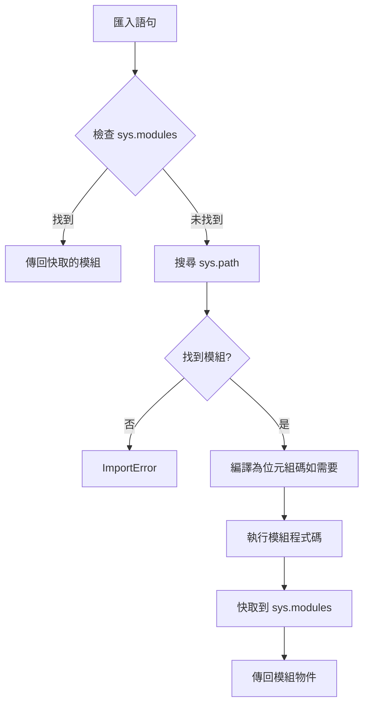

# Python 匯入系統

Python 的匯入系統是一個核心機制，影響程式碼組織、效能和可維護性。理解匯入的工作原理對於構建可擴展應用程式至關重要，特別是在深度學習專案等大型程式碼庫中。

## 匯入基礎

### 絕對匯入 vs 相對匯入

Python 支援兩種匯入風格，各有特定使用場景。

| 匯入類型 | 語法 | 使用場景 | 作用域 |
| :--- | :--- | :--- | :--- |
| **絕對匯入** | `from package import module` | 生產程式碼、函式庫 | 專案級 |
| **顯式相對匯入** | `from . import sibling` | 套件內部模組 | 套件內 |
| **隱式相對匯入** | `import sibling` | **Python 3 中已棄用** | - |

**絕對匯入**適用於大多數場景：

```python
# ✅ 推薦：絕對匯入
from my_package.utils.helpers import load_config
from my_package.core.engine import InferenceEngine

# ✅ 可接受：顯式相對匯入（同一套件內）
from .utils.helpers import load_config
from ..core.engine import InferenceEngine

# ❌ 避免：隱式相對匯入（Python 3 報錯）
import helpers  # 在 Python 3 中引發 ImportError
```

:::tip 何時使用相對匯入
相對匯入適用於以下場景：
- 重構套件內部程式碼，套件名稱可能改變
- 同一套件內匯入路徑過長
- 需要明確指示匯入的模組屬於同一套件
:::

### `__init__.py` 的作用

`__init__.py` 檔案將目錄標記為 Python 套件，並可以控制套件的公共 API。

```python
# my_package/__init__.py
from .core import Engine
from .utils import load_config

# 定義公共 API
__all__ = ["Engine", "load_config"]
```

:::info 最佳實踐
使用 `__init__.py` 來：
- 提供簡化的套件級 API
- 從匯入中隱藏內部模組
- 執行套件初始化程式碼（日誌記錄、版本檢查）
:::

### 匯入搜尋路徑（`sys.path`）

Python 按以下順序搜尋模組：

1. **當前目錄**（對於腳本）或**腳本所在目錄**
2. **`PYTHONPATH` 環境變數**中的目錄
3. **標準函式庫位置**（取決於安裝）
4. **site-packages**（第三方套件）

```python
import sys
print("\n".join(sys.path))

# 以程式設計方式新增自訂路徑（謹慎使用）
sys.path.append("/custom/module/path")
```

:::danger 危險
避免在生產程式碼中以程式設計方式修改 `sys.path`。這會使程式碼變得脆弱且依賴部署環境。應使用正確的套件安裝或 `PYTHONPATH` 代替。
:::

---

## 匯入機制（底層原理）

### `sys.modules` 快取

Python 在 `sys.modules` 中維護已匯入模組的快取。一旦模組被匯入，後續的匯入將傳回快取的模組物件。

```python
import sys
import math

# 首次匯入後模組被快取
print(math is sys.modules["math"])  # True

# 重新載入（很少需要）
import importlib
importlib.reload(math)
```

:::note
`sys.modules` 快取意味著匯入語句本質上是單例建構函式。模組級程式碼在每個直譯器階段中只執行一次。
:::

### 匯入語句執行流程



### 使用 `importlib` 動態匯入

對於執行時動態匯入，使用 `importlib` 模組而不是 `__import__` 或 `eval`。

```python
import importlib

# 透過字串名稱動態匯入
module_name = "yaml"
yaml = importlib.import_module(module_name)

# 條件匯入（適用於可選依賴）
try:
    import plotly
except ImportError:
    plotly = None

def plot(data):
    if plotly is None:
        raise ImportError("plotly 是視覺化所必需的")
    plotly.plot(data)
```

:::tip 使用場景
動態匯入適用於：
- 插件系統
- 延遲載入重型依賴
- 功能標誌和可選依賴
:::

---

## 工程實踐

### 避免循環匯入

當模組 A 匯入模組 B，而模組 B 匯入模組 A（直接或間接）時，會發生循環匯入。這會導致執行時錯誤或未定義行為。

**問題：**

```python title="models.py"
from trainers import Trainer

class Model:
    def train(self):
        return Trainer().train(self)
```

```python title="trainers.py"
from models import Model

class Trainer:
    def train(self, model: Model):
        pass
```

**解決方案：**

**✅ 方案 1：使用字串字面量的型別提示**

```python title="models.py"
from typing import TYPE_CHECKING

if TYPE_CHECKING:
    from trainers import Trainer

class Model:
    def train(self):
        from trainers import Trainer  # 區域匯入
        return Trainer().train(self)
```

---

**✅ 方案 2：重構為第三個模組**

```python title="interfaces.py"
from abc import ABC, abstractmethod

class Trainable(ABC):
    @abstractmethod
    def train(self): pass
```

```python title="models.py"
from trainers import Trainer
from interfaces import Trainable

class Model(Trainable):
    def train(self):
        return Trainer().train(self)
```

:::info 執行時 vs 型別檢查
`TYPE_CHECKING` 常量在執行時為 `False`，但在靜態型別檢查期間為 `True`。這允許為型別提示匯入模組而不會導致循環依賴。
:::

### 匯入效能最佳化

對於大型應用程式，考慮對重型依賴進行延遲匯入。

**❌ 急切載入：所有匯入在啟動時載入**

```python
import torch
import transformers
import numpy as np

def main():
    # 即使未使用也會載入重型模組
    pass
```

**✅ 延遲載入：推遲匯入直到需要時**

```python
def main():
    import torch
    import transformers
    import numpy as np

    # 僅在呼叫 main() 時才載入模組
    pass
```

**✅ 使用 `importlib` 的顯式延遲載入**

```python
import importlib

_torch = None

def get_torch():
    global _torch
    if _torch is None:
        import torch
        _torch = torch
    return _torch
```

:::tip 權衡
延遲匯入可以改善啟動時間，但會將錯誤從啟動時轉移到執行時。將其用於真正可選或很少使用的依賴。
:::

### 匯入語句風格（PEP 8）

將匯入組織為三組，組之間用空行分隔：

```python
# 1. 標準函式庫匯入
import os
import sys
from pathlib import Path

# 2. 第三方匯入
import numpy as np
import torch
from fastapi import FastAPI

# 3. 本地應用程式匯入
from my_package.core import Engine
from my_package.utils.helpers import load_config
```

配置 **Ruff** 自動執行此操作：

```toml
[tool.ruff.lint.isort]
known-first-party = ["my_package"]
force-sort-within-sections = true
```

---

## 常見陷阱

### 遮蔽標準函式庫模組

避免將檔案或模組命名為與標準函式庫模組相同的名稱。

```text
# ❌ 有問題的結構
project/
├── random.py         # 遮蔽標準函式庫 random
└── main.py

# main.py
import random  # 匯入你的檔案，而非標準函式庫！
```

:::danger 危險
被遮蔽的模組會導致神秘的 bug，並使除錯變得極其困難。始終檢查命名衝突。
:::

### 相對匯入邊界

相對匯入不能超過頂層套件。

```python
# ✅ 有效：套件內
# my_package/subpkg1/module.py
from ..subpkg2 import helper

# ❌ 無效：套件外
# my_package/subpkg1/module.py
from ...external_lib import something  # ImportError
```

### 可執行模組 vs 可匯入套件

模組可以既是可執行的又是可匯入的：

```python
# my_package/cli.py
import argparse

def main():
    """CLI 的進入點。"""
    parser = argparse.ArgumentParser()
    args = parser.parse_args()
    # CLI 邏輯在這裡

if __name__ == "__main__":
    main()  # 僅在直接執行時執行
```

在 `pyproject.toml` 中設定：

```toml
[project.scripts]
mycli = "my_package.cli:main"
```

---

## 檢查清單

- [ ] 預設使用絕對匯入
- [ ] 使用 `TYPE_CHECKING` 或重構避免循環依賴
- [ ] 配置 Ruff 強制執行匯入排序
- [ ] 永遠不要在生產程式碼中修改 `sys.path`
- [ ] 使用 `__init__.py` 定義清晰的套件 API
- [ ] 檢查模組名遮蔽
- [ ] 考慮對重型依賴使用延遲匯入

---

## 延伸閱讀

- [PEP 8 -- Python 程式碼風格指南](https://peps.python.org/pep-0008/#imports)
- [PEP 328 -- 匯入：多行和絕對/相對](https://peps.python.org/pep-0328/)
- [Python 匯入系統文件](https://docs.python.org/zh-cn/3/reference/import.html)
- [`importlib` 套件](https://docs.python.org/zh-cn/3/library/importlib.html)
